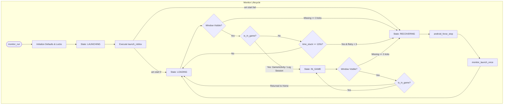
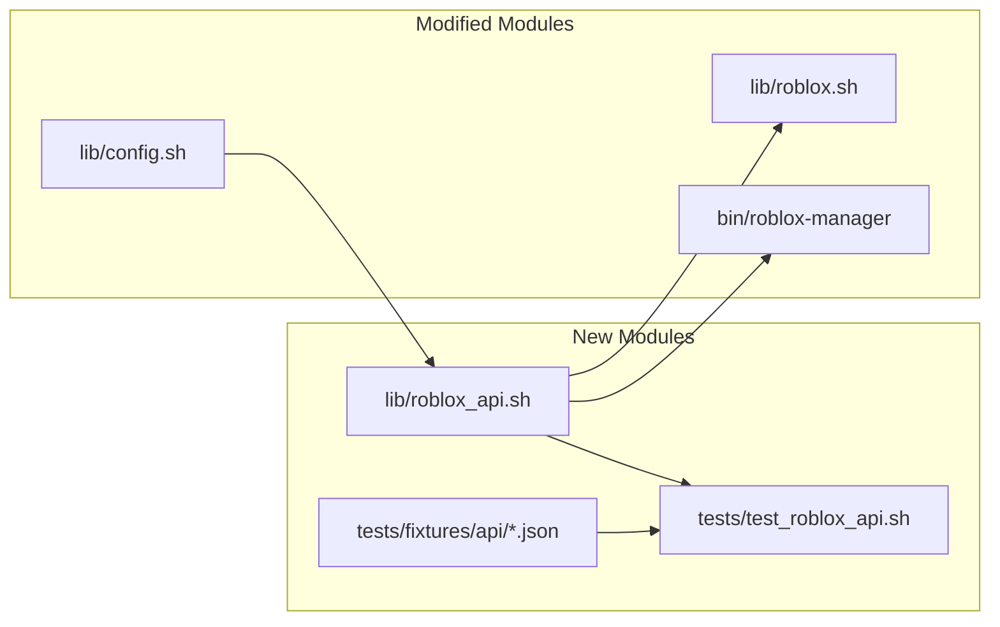

# P0.1 — Repository Audit & Roblox API Architecture Preparation Report

**Document Version:** 1.0.0  
**Phase:** P0.1 (Architecture & Analysis Only — No production code modified)  
**Target Repository:** `Gnas260605/auto-rejoin`  
**Inspected Commit:** `a22521256f4d4fbc2b642f35f607859b08480173` (main)  
**Target Architectural Blueprint:** `AUTO_REJOIN_PRO_V2_ROBLOX_API_PLAN.md`  

---

## 1. Current Architecture Overview

### 1.1 Module Inventory & Responsibilities

| Module | Core Responsibility | Current Key Functions | External Dependencies |
|---|---|---|---|
| [`auto_rejoin.sh`](file:///d:/Individua_Project/ToolAutoRoblox/auto_rejoin.sh) | Main interactive menu, multi-account orchestrator, process/window/session checks, launch executor. | `launch_roblox`, `is_roblox_running`, `check_roblox_window_visible`, `check_roblox_task_present`, `check_roblox_log_for_game_session`, `is_in_game`, `detect_roblox_session_state`. | `lib/android.sh`, `lib/config.sh`, `lib/monitor.sh`, `lib/roblox.sh`, `tmux`, `su`/`adb`. |
| [`lib/android.sh`](file:///d:/Individua_Project/ToolAutoRoblox/lib/android.sh) | Typed Android command execution layer (su, adb, direct) with argument sanitization. | `android_is_process_running`, `android_is_task_present`, `android_is_window_visible`, `android_get_resumed_activity`, `android_start_uri_fresh`. | Android CLI (`am`, `pm`, `dumpsys`, `input`, `pidof`, `pgrep`, `ps`, `settings`, `wm`). |
| [`lib/config.sh`](file:///d:/Individua_Project/ToolAutoRoblox/lib/config.sh) | Safe key-value config parser, validator, and serializer without shell evaluation. | `config_load`, `config_save`, `config_init_defaults`, `config_validate_all`, `config_is_allowed_key`. | None (Pure POSIX/Bash). |
| [`lib/monitor.sh`](file:///d:/Individua_Project/ToolAutoRoblox/lib/monitor.sh) | State machine for individual account lifecycle (`LAUNCHING`, `LOADING`, `IN_GAME`, `CRASHED`, `DISCONNECTED`, `RECOVERING`, `COOLDOWN`, `OFFLINE`). | `monitor_tick`, `monitor_handle_loading`, `monitor_handle_in_game`, `monitor_handle_recovering`, `monitor_transition`, `monitor_record_recovery_failure`. | `lib/runtime.sh`, `lib/logger.sh`, `lib/android.sh`. |
| [`lib/roblox.sh`](file:///d:/Individua_Project/ToolAutoRoblox/lib/roblox.sh) | Roblox link parser, Place ID / Job ID / Private code validation, URI builders, public server fetch. | `roblox_parse_game_url`, `roblox_build_game_uri`, `roblox_build_private_server_uri`, `roblox_fetch_public_servers`, `roblox_pick_low_server`. | `curl`, `jq` / `python3` / `node`. |
| [`lib/network.sh`](file:///d:/Individua_Project/ToolAutoRoblox/lib/network.sh) | Generic curl wrapper with `--fail` and basic retry logic. | `network_get`, `network_post_json`, `network_download_secure_https`, `network_is_online`. | `curl`, `ping`. |
| [`lib/runtime.sh`](file:///d:/Individua_Project/ToolAutoRoblox/lib/runtime.sh) | File locking, process liveness check, exponential backoff, failure history tracking, and cooldown timer. | `runtime_lock_acquire`, `runtime_lock_release`, `runtime_backoff_next`, `runtime_failure_record`, `runtime_cooldown_start`. | File system (`mkdir` locks, `flock`). |
| [`lib/logger.sh`](file:///d:/Individua_Project/ToolAutoRoblox/lib/logger.sh) | Structured key-value logging, log rotation, ANSI color stripping, secret/token redaction. | `log_event`, `log_write`, `log_info`, `log_warn`, `log_error`, `log_redact_secret`. | None. |
| [`lib/notification.sh`](file:///d:/Individua_Project/ToolAutoRoblox/lib/notification.sh) | Discord webhook dispatcher with retry and secret URL masking. | `discord_send_message`, `discord_send_embed`. | `lib/network.sh`. |
| [`lib/license.sh`](file:///d:/Individua_Project/ToolAutoRoblox/lib/license.sh) | License token caching, validation against license server, activation/deactivation. | `license_validate`, `license_activate`, `license_load_cached_token`. | `lib/network.sh`, OpenSSL/crypto. |
| [`lib/entitlement.sh`](file:///d:/Individua_Project/ToolAutoRoblox/lib/entitlement.sh) | Feature gating (`anti_afk`, `low_server`, `freeform`, `multi_instance`, `auto_restart`). | `entitlement_require_feature`, `entitlement_admit_instance`. | `lib/license.sh`. |
| [`bin/roblox-manager`](file:///d:/Individua_Project/ToolAutoRoblox/bin/roblox-manager) | Unified CLI front-end for doctor, license, profile, setup, update, and diagnostics. | `manager_doctor`, `manager_setup`, `manager_license`, `manager_support_bundle`. | All `lib/*.sh` modules. |
| [`setup.sh`](file:///d:/Individua_Project/ToolAutoRoblox/setup.sh) | Initial bootstrap installer for Termux / UGPhone dependencies. | Automated dependency installation (`pkg install jq tmux curl`). | Termux `pkg` / `apt`. |

### 1.2 Core Execution Flows



---

## 2. Current Problems & Design Risks

| ID | Issue Description | Severity | File & Location | Current Risky Behavior | Why It Is Fragile | Target Phase for Resolution |
|---|---|---|---|---|---|---|
| **ISSUE-01** | `TASK_PRESENT` falls back to `WINDOW_VISIBLE` | **P0** | [`auto_rejoin.sh:638-643`](file:///d:/Individua_Project/ToolAutoRoblox/auto_rejoin.sh#L638-L643), [`lib/android.sh:202-209`](file:///d:/Individua_Project/ToolAutoRoblox/lib/android.sh#L202-L209) | `check_roblox_window_visible()` falls back to `check_roblox_task_present()`. Furthermore, `android_is_window_visible()` regex matches `Task{...package}`. | On Android Freeform/Multi-window (UGPhone), closing the 'X' button removes the Window/Surface, but Android frequently retains the `Task` and `ActivityRecord` in background memory. Falling back to task presence returns `true` (visible), causing the monitor to believe the window is still open when it is actually closed. | **Phase P0.2** (Android Visibility Engine) |
| **ISSUE-02** | `am start` exit code 0 treated as successful launch | **P0** | [`auto_rejoin.sh:516-570`](file:///d:/Individua_Project/ToolAutoRoblox/auto_rejoin.sh#L516-L570) | `launch_roblox()` treats `$ret -eq 0` from `am start` as immediate `launch_success=true`. | `am start` returns 0 as long as Android ActivityManager accepts the Intent. If the package crashes instantly on startup, fails signature checks, or gets blocked by permissions, `am start` still returns 0. The bot assumes launch succeeded and enters a 60s `LAUNCH_GRACE` blind window. | **Phase P0.4** (Verified Launch Transaction) |
| **ISSUE-03** | Stale session log pollution via `tail -n X` | **P0** | [`auto_rejoin.sh:673, 792, 833`](file:///d:/Individua_Project/ToolAutoRoblox/auto_rejoin.sh#L673) | `check_roblox_log_for_game_session` (`tail 80`), `check_roblox_log_for_disconnect` (`tail 25`), `check_roblox_log_for_wrong_place` (`tail 220`) read fixed line offsets from the latest file on disk. | If Roblox restarts into the same log file (or before Android rotates logs), old handshake strings (`Joining game`, `placeId:...`) from 10 minutes ago will match in the tail, falsely verifying a new crashed/stuck session as active gameplay. | **Phase P0.3** (Incremental Session Log Parser) |
| **ISSUE-04** | Initial handshake log entries classified as `GAME_ACTIVE` | **P0** | [`auto_rejoin.sh:677`](file:///d:/Individua_Project/ToolAutoRoblox/auto_rejoin.sh#L677) | Regex matches `placeId...\|Joining game\|Connected to game server\|UniverseId` as proof of game session. | `Joining game` and `UniverseId` appear during early network handshake before assets load, before 3D engine initializes, and before character spawn. If the game hangs at 99% loading or gets rejected by matchmaking, the bot considers it `GAME_ACTIVE`. | **Phase P0.3** (Session Evidence Classification) |
| **ISSUE-05** | Monolithic Public Server Fetching in `lib/roblox.sh` | **P1** | [`lib/roblox.sh:123-231`](file:///d:/Individua_Project/ToolAutoRoblox/lib/roblox.sh#L123-L231) | Single unauthenticated request without pagination (`nextPageCursor`), no circuit breaker, no exponential backoff on HTTP 429, no memory of recently failed Job IDs. | If the first 100 servers returned by Roblox are full or failing, the bot cannot page further, and will repeatedly attempt the same failing server Job ID. | **Phase P0.1 / P1.3** (`lib/roblox_api.sh`) |
| **ISSUE-06** | Test Mocks Execute Sequentially in Single Process | **P2** | [`tests/test_monitor.sh:340-365`](file:///d:/Individua_Project/ToolAutoRoblox/tests/test_monitor.sh#L340-L365) | `test_scenario_8_multiple_clones_isolation` runs Clone A and Clone B in the same shell subshell sequentially by overriding global variables. | Does not validate concurrent subshell file lock contention, PID tracking collisions, or shared snapshot race conditions across real parallel background processes. | **Phase P0.1** (Integration Test Framework) |
| **ISSUE-07** | Unit Tests Claim Stronger Behavior than Actually Asserted | **P2** | [`tests/test_monitor.sh:322-385`](file:///d:/Individua_Project/ToolAutoRoblox/tests/test_monitor.sh#L322-L385) | `test_scenario_7_freeform_window_closed` mocks `launch_roblox` without verifying `--launch-bounds`, and `test_scenario_10` sets `LAUNCH_OK=false` rather than asserting `am start` exit 0 with missing window. | Gives false confidence that real Android windowing and launch verification are thoroughly validated in CI when only mock state transitions were checked. | **Phase P0.1 / P0.4** (Mock & Fixture Hardening) |

---

## 3. Roblox Public API Architecture & Design

To isolate networking, caching, rate-limiting, and JSON validation from game logic and state machines, a dedicated module **`lib/roblox_api.sh`** is designed.

```text
lib/
├── android.sh          (Android shell transport & dumpsys inspection)
├── config.sh           (Typed configuration parser & validator)
├── monitor.sh          (State machine & recovery engine)
├── network.sh          (Generic curl helpers)
├── roblox.sh           (Local URL parsing, Place ID/Job ID validation, URI building)
└── roblox_api.sh  NEW  (Roblox HTTP transport, cache, circuit breaker, endpoints)
```

### 3.1 Function Specifications for `lib/roblox_api.sh`

```bash
# ── Core HTTP Transport ───────────────────────────────────
roblox_http_get "$url" ["$provider"] ["$timeout"]
roblox_http_post_json "$url" "$json_payload" ["$provider"] ["$timeout"]

# ── API Cache Layer ───────────────────────────────────────
roblox_api_cache_get "$cache_key"
roblox_api_cache_set "$cache_key" "$json_data" "$ttl_seconds"
roblox_api_cache_purge_expired

# ── Provider Circuit Breaker ──────────────────────────────
roblox_api_is_available "$provider"
roblox_api_record_success "$provider"
roblox_api_record_failure "$provider" ["$http_status"]

# ── Roblox Public Endpoints ───────────────────────────────
roblox_api_place_to_universe "$place_id"
roblox_api_get_game "$universe_id"
roblox_api_get_public_servers "$place_id" ["$cursor"] ["$limit"]
roblox_api_pick_server "$place_id" "$slot_index" ["$min_players"] ["$max_players"] ["$failed_jobs_csv"]
roblox_api_resolve_username "$username"
roblox_api_get_presence "$user_id"
```

### 3.2 Standard Return Codes

| Return Code | Symbolic Name | Meaning | Monitor Handling |
|---|---|---|---|
| `0` | `API_OK` | Request succeeded, valid JSON parsed, schema valid. | Use data, reset provider breaker. |
| `1` | `API_ERR_GENERIC` | Unclassified runtime/script error. | Fail-open, use local signals. |
| `2` | `API_ERR_INVALID_ARG` | Bad Place ID, malformed username, negative User ID. | Log error, do not retry invalid arg. |
| `3` | `API_ERR_TIMEOUT` | Connection timed out or exceeded max runtime. | Record breaker failure, fail-open. |
| `4` | `API_ERR_RATE_LIMIT` | HTTP 429 Too Many Requests. | Trip breaker for 60s, honor `Retry-After`. |
| `5` | `API_ERR_BREAKER_OPEN` | Provider is currently cooling down after consecutive errors. | Immediately return cached data or skip. |
| `6` | `API_ERR_SCHEMA` | HTTP 200 returned but JSON was malformed or missing fields. | Fail-open, record failure. |

### 3.3 Cache Envelope & Storage Layout

Cache Directory: `tmp/api-cache/` (ignored in `.gitignore`).

Envelope Schema:
```json
{
  "cachedAt": 1789690000,
  "expiresAt": 1789776400,
  "status": 200,
  "provider": "universes",
  "data": {
    "universeId": 1234567890
  }
}
```

Cache File Naming & TTL:
- `place_<PLACE_ID>_universe.json` ➔ **TTL: 24 hours** (86,400s)
- `universe_<UNIVERSE_ID>_game.json` ➔ **TTL: 10 minutes** (600s)
- `user_<NORMALIZED_USERNAME>.json` ➔ **TTL: 24 hours** (86,400s)
- `presence_<USER_ID>.json` ➔ **TTL: 20 seconds**
- `servers_<PLACE_ID>_<CURSOR_HASH>.json` ➔ **TTL: 15 seconds**

### 3.4 Provider Circuit Breaker Specification

Independent Providers:
1. `universes` (`apis.roblox.com`)
2. `games` (`games.roblox.com`)
3. `servers` (`games.roblox.com`)
4. `users` (`users.roblox.com`)
5. `presence` (`presence.roblox.com`)

Circuit Rules:
- **Threshold**: 3 consecutive failures (timeouts, 5xx, or 429) on a specific provider.
- **Trip Duration**: Provider disabled for 60 seconds (`ROBLOX_API_BREAKER_COOLDOWN=60`).
- **Isolation**: A failure in `presence.roblox.com` does NOT affect `games.roblox.com` or `apis.roblox.com`.
- **Fail-Open Policy**: When a provider is open/disabled, API functions immediately return `API_ERR_BREAKER_OPEN` (exit code 5) without executing network calls, allowing `monitor_tick` to finish in milliseconds without lag.

---

## 4. File Change Plan for Implementation



### Detailed File Actions

1. **`CREATE lib/roblox_api.sh`**:
   - Implements `roblox_http_get`, `roblox_http_post_json`, cache CRUD, circuit breaker, and 5 endpoint clients.
   - Dependencies: `lib/logger.sh`, `lib/config.sh`.
2. **`CREATE tests/test_roblox_api.sh`**:
   - Full automated test suite for HTTP parsing, cache hits/misses/expiry, breaker transitions, schema validation, and fail-open behaviors.
3. **`CREATE tests/fixtures/api/`**:
   - `place_universe_ok.json`, `place_universe_invalid.json`
   - `game_info_ok.json`, `game_info_empty.json`
   - `servers_page_1.json`, `servers_page_2.json`
   - `presence_ingame.json`, `presence_online.json`, `presence_offline.json`, `presence_hidden.json`
   - `username_resolve_ok.json`, `username_not_found.json`
   - `rate_limit_429.json`, `malformed.json`
4. **`MODIFY lib/config.sh`**:
   - Add new config keys to defaults, whitelist, validation, and serializer.
5. **`MODIFY lib/roblox.sh`**:
   - Refactor `roblox_pick_low_server` and `roblox_fetch_public_servers` to delegate networking to `lib/roblox_api.sh` while preserving backward compatibility.
6. **`MODIFY bin/roblox-manager`**:
   - Source `lib/roblox_api.sh` and add `roblox-manager api <endpoint>` diagnostics subcommands.

---

## 5. API Dependency & Fallback Matrix

| Feature | Primary Local Signal | Secondary Roblox API | Mandatory? | Cache TTL | Fallback Behavior on API Failure |
|---|---|---|---|---|---|
| **Process Health** | Android `pidof` / `ps` | None | Yes (Local) | None | N/A (Local check) |
| **Window State** | Android `dumpsys window` | None | Yes (Local) | None | N/A (Local check) |
| **Session Active** | Android `dumpsys activity top` + Game log | Presence API (`presence.roblox.com`) | **No (Optional)** | 20s | Trust local `GameActivity` and game session log. Ignore missing presence. |
| **Experience Verification** | Session log `UniverseId` / `placeId` | Place→Universe API (`apis.roblox.com`) | **No (Optional)** | 24h | Treat observed place as valid if within `ALLOWED_GAME_PLACE_IDS` or same configured `PLACE_ID`. |
| **Experience Metadata** | Config `PLACE_ID` | Game Info API (`games.roblox.com`) | **No (Optional)** | 10m | Use fallback name `Roblox Experience (PLACE_ID)`. |
| **Low Server Selection** | Config `PLACE_ID` | Public Servers API (`games.roblox.com`) | **No (Optional)** | 15s | Fallback to default matchmaking deep-link (`roblox://experiences/start?placeId=...`). |
| **Username Resolution** | Config `ROBLOX_USERNAME` / SharedPreferences | Users API (`users.roblox.com`) | **No (Optional)** | 24h | Use raw username from config or display `N/A`. |

---

## 6. Failure Matrix & Resiliency Strategy

| Failure Scenario | HTTP / Error Code | Immediate API Action | Cache Reaction | Impact on Monitor Loop |
|---|---|---|---|---|
| **HTTP 429 Too Many Requests** | 429 | Record failure for provider, check `Retry-After` header, trip breaker for 60s. | Use cached response if exists (even if expired if stale-ok enabled). | **Zero disruption**. Monitor logs warning and continues with local signals. |
| **Connection Timeout** | 28 / 124 | Abort after `ROBLOX_API_CONNECT_TIMEOUT` (4s), record provider failure. | Return expired cache if available, else return exit code 3. | Monitor tick completes within bound (`< 5s`), no watchdog hang. |
| **DNS Resolution Failure** | 6 | Return exit code 3, record provider failure. | Return cached data if available. | Monitor continues normally. |
| **HTTP 500 / 502 / 503** | 500..503 | Return exit code 1, record provider failure. | Return cached data if available. | Monitor logs `api_degraded`, falls back to local evidence. |
| **Malformed JSON / Partial Body** | 200 (Bad Body) | Parser fails schema validation, returns exit code 6. | Cache is NOT overwritten with corrupt data. | Monitor rejects bad API data, relies on local logs. |
| **Privacy Hidden Presence** | 200 (`placeId: null`) | Extract `userPresenceType`. If `null` place, return `IN_GAME_UNKNOWN_PLACE`. | Cache for 20s. | Evaluator treats presence as **inconclusive**, does not classify as out-of-game. |
| **Device Offline (No Network)** | Network failure | `network_is_online` trips ➔ Monitor enters `OFFLINE` state. | No API requests attempted while offline. | Monitor pauses rejoin loop, prevents restart storms. |

---

## 7. Proposed Configuration Schema Additions

To support the Roblox API architecture without breaking existing configurations, the following keys are planned:

```ini
# ── Roblox API & Presence ─────────────────────────────────
ROBLOX_API_ENABLED="true"              # Enable/disable public Roblox API requests (boolean)
ROBLOX_API_CONNECT_TIMEOUT="4"         # Max seconds for HTTP connection (1..15)
ROBLOX_API_MAX_TIME="8"                # Max total seconds for HTTP request (2..30)
ROBLOX_API_CACHE_ENABLED="true"        # Cache API responses in tmp/api-cache (boolean)
ROBLOX_API_BREAKER_LIMIT="3"           # Consecutive failures before tripping breaker (1..10)
ROBLOX_API_BREAKER_COOLDOWN="60"       # Seconds to wait before retrying tripped provider (10..600)
ROBLOX_USER_ID=""                      # Numeric Roblox User ID (resolved or manual)
PRESENCE_ENABLED="true"                # Enable Presence API polling (boolean)
PRESENCE_INTERVAL="20"                 # Minimum seconds between Presence queries (10..300)

# ── Experience & Universe Intelligence ────────────────────
AUTO_DISCOVER_UNIVERSE="true"          # Auto-query Universe ID from Place ID (boolean)
EXPECTED_UNIVERSE_ID=""                # Expected Universe ID (auto-populated or manual)
ALLOWED_GAME_PLACE_IDS=""              # Comma-separated list of Place IDs in same Universe
TRANSIT_TIMEOUT="120"                  # Max seconds allowed in lobby/transit place before retry (30..600)

# ── Low Server V2 Enhancements ────────────────────────────
LOW_SERVER_MAX_PAGES="3"               # Max pages of public servers to fetch via cursor (1..10)
FAILED_JOB_TTL="300"                   # Seconds to remember and blacklist failed Job IDs (60..3600)
```

### Backward Compatibility Verification
- Default values maintain 100% compatibility with existing `config_com*.cfg` and legacy `config.cfg`.
- Missing keys automatically assume default values via `config_init_defaults`.
- No existing variable names are modified or repurposed.

---

## 8. Test Suite Design (`tests/test_roblox_api.sh`)

The test suite will operate entirely offline using mock JSON fixtures in `tests/fixtures/api/`.

### Planned Test Cases

```text
1. Place to Universe:
   - PASS: Valid Place ID returns correct integer universeId from fixture
   - PASS: Invalid JSON response returns API_ERR_SCHEMA (6)
   - PASS: HTTP 404 response returns API_ERR_GENERIC (1)
   - PASS: Response is written to tmp/api-cache/ with correct TTL (24h)
   - PASS: Subsequent call within TTL reads from cache without network invocation

2. Game Info:
   - PASS: Valid Universe ID parses rootPlaceId, name, maxPlayers
   - PASS: Empty data array handled cleanly

3. Public Servers V2:
   - PASS: Parses data array, sorts by playing and ping
   - PASS: Handles pagination (nextPageCursor)
   - PASS: Blacklists failed Job IDs supplied in failed_jobs_csv
   - PASS: Ignores full games (playing >= maxPlayers)

4. Username Resolution:
   - PASS: Valid username returns numeric id
   - PASS: Non-existent username returns API_ERR_INVALID_ARG

5. Presence:
   - PASS: InGame presence with matching placeId returns confidence boost
   - PASS: Privacy-hidden presence (null placeId/gameId) returns IN_GAME_UNKNOWN_PLACE
   - PASS: Offline presence returns OFFLINE

6. Circuit Breaker & Resiliency:
   - PASS: 3 consecutive timeouts trip provider breaker to API_ERR_BREAKER_OPEN (5)
   - PASS: Breaker cooldown expires after specified seconds and allows probe request
   - PASS: Breaker trip on presence provider does NOT affect games provider
   - PASS: HTTP 429 triggers 60s cooldown immediately
```

---

## 9. Implementation Roadmap & Execution Order

```text
┌─────────────────────────────────────────────────────────────┐
│ PHASE P0.1 (Current): Repository Audit & API Spec           │
│ - Output: P0_1_ROBLOX_API_IMPLEMENTATION_REPORT.md         │
└──────────────────────────────┬──────────────────────────────┘
                               │
┌──────────────────────────────▼──────────────────────────────┐
│ PHASE P0.1 Execution: lib/roblox_api.sh & Test Fixtures     │
│ 1. Create tests/fixtures/api/*.json                        │
│ 2. Create lib/roblox_api.sh (HTTP, Cache, Breaker, APIs)    │
│ 3. Add config keys to lib/config.sh & test in test_config.sh│
│ 4. Create tests/test_roblox_api.sh & achieve 100% pass      │
│ 5. Integrate roblox_api into roblox-manager & roblox.sh     │
└──────────────────────────────┬──────────────────────────────┘
                               │
┌──────────────────────────────▼──────────────────────────────┐
│ PHASE P0.2: Android Visibility Engine                       │
│ - Remove Task fallback from window detection                │
│ - Implement strict Window/Surface dump parsing              │
└──────────────────────────────┬──────────────────────────────┘
                               │
┌──────────────────────────────▼──────────────────────────────┐
│ PHASE P0.3: Incremental Session Log Parser                  │
│ - Implement byte-offset tracking & inode validation         │
│ - Differentiate JOIN_STARTED vs SERVER_CONNECTED vs ACTIVE  │
└──────────────────────────────┬──────────────────────────────┘
                               │
┌──────────────────────────────▼──────────────────────────────┐
│ PHASE P0.4: Verified Launch Transaction                     │
│ - Implement 3-stage launch verification                     │
│ - Handle am start=0 with missing process/window             │
└──────────────────────────────┬──────────────────────────────┘
                               │
┌──────────────────────────────▼──────────────────────────────┐
│ PHASE P1.1 - P3: Unified Engine & Real Device Pilot         │
└─────────────────────────────────────────────────────────────┘
```

---

## 10. Risks & Real-Device Hardware Unknowns

| Risk / Unknown | Impact | Why Unit Tests Cannot Prove It | Mitigation / Validation Plan |
|---|---|---|---|
| **Android Dumpsys Differences on UGPhone** | `dumpsys window windows` output format varies significantly across Android 10, 11, 12, and 13 (e.g. `mCurrentFocus` vs `mFocusedApp` vs `mResumedActivity`). | Local unit tests use synthetic mock text strings. | Capture raw `dumpsys` outputs from physical UGPhone instances across multiple Android OS versions during Phase P0.2. |
| **Roblox Log Rotation Timing** | Roblox Android client rotates log files asynchronously upon launching new activities. | Local file fixtures are static. | Incremental parser in Phase P0.3 must track file inode and reset byte offset to 0 when inode changes. |
| **Shared IP Rate Limiting on Cloud Phones** | UGPhone cloud instances in the same data center often share egress public IPv4 NAT gateways, potentially causing shared Roblox HTTP 429 rate limits. | Local test suite runs on private IP. | Circuit breaker with fast fail-open local fallback ensures bot operates with 100% stability even under severe 429 conditions. |
