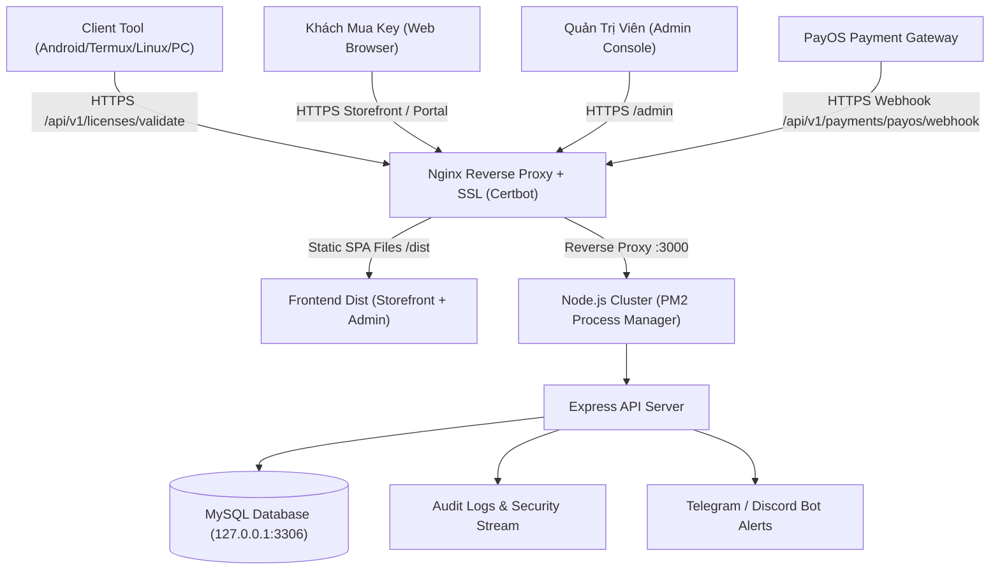

# Kế Hoạch Triển Khai Production Chi Tiết (Production Deployment & Go-Live Plan)
**Dự Án**: Auto Rejoin Pro — License Authority & Automation Tool  
**Phiên Bản**: v4.0.0  
**Thời Gian Cập Nhật**: Tháng 09/2026

---

## 1. Kiến Trúc Mạng & Luồng Dữ Liệu Production



---

## 2. Các Giai Đoạn Triển Khai Chi Tiết

### Giai Đoạn 1: Chuẩn Bị Hạ Tầng & Bí Mật Môi Trường (Secrets & Environment)
- [ ] **Khởi tạo VPS Production** (Ubuntu 22.04 / 24.04 LTS, tối thiểu 2 vCPU, 2-4GB RAM, SSD NVMe).
- [ ] **Sinh bộ Secret bảo mật cao (32+ bytes cryptographic random)**:
  ```bash
  # 1. Sinh LICENSE_KEY_PEPPER (BẮT BUỘC lưu trữ offline an toàn)
  openssl rand -base64 32
  
  # 2. Sinh ADMIN_JWT_SECRET
  openssl rand -base64 32
  
  # 3. Sinh CSRF / Session Secrets
  openssl rand -hex 24
  ```
- [ ] **Cấu hình file `server/.env` chuẩn trên production server**:
  ```ini
  NODE_ENV=production
  PORT=3000
  DB_HOST=127.0.0.1
  DB_PORT=3306
  DB_NAME=auto_rejoin_license
  DB_USER=auto_rejoin_app
  DB_PASSWORD=StrongDatabasePasswordHere
  
  LICENSE_KEY_PEPPER=GeneratedBase64PepperHere
  ADMIN_JWT_SECRET=GeneratedBase64JwtSecretHere
  
  COOKIE_SECURE=true
  COOKIE_SAMESITE=strict
  ADMIN_ORIGIN=https://admin.yourdomain.com,https://yourdomain.com
  CLIENT_BASE_URL=https://yourdomain.com
  ```

---

### Giai Đoạn 2: Cơ Sở Dữ Liệu & Phân Quyền Tối Thiểu (MySQL Least Privilege & Migration)
- [ ] **Cài đặt & Cấu hình MySQL 8.0+**:
  - Đảm bảo `bind-address = 127.0.0.1` trong `/etc/mysql/mysql.conf.d/mysqld.cnf`.
  - Khởi tạo Database với bảng mã Unicode đầy đủ:
    ```sql
    CREATE DATABASE auto_rejoin_license CHARACTER SET utf8mb4 COLLATE utf8mb4_unicode_ci;
    ```
- [ ] **Tạo User ứng dụng riêng biệt (Không dùng root)**:
  ```sql
  CREATE USER 'auto_rejoin_app'@'127.0.0.1' IDENTIFIED BY 'StrongRandomDbPassword123!';
  GRANT SELECT, INSERT, UPDATE, DELETE ON auto_rejoin_license.* TO 'auto_rejoin_app'@'127.0.0.1';
  FLUSH PRIVILEGES;
  ```
- [ ] **Chạy toàn bộ Schema Migrations**:
  ```bash
  cd server
  npm run migrate
  ```
- [ ] **Khởi tạo Super Admin an toàn**:
  ```bash
  node scripts/create-admin.js --username="superadmin" --password="StrongPasswordGoesHere"
  ```
- [ ] **Thiết lập Cronjob Backup Database tự động** hàng ngày lúc 02:00 sáng và tự xóa bản sao lưu sau 30 ngày.

---

### Giai Đoạn 3: Cổng Thanh Toán PayOS Production
- [ ] Đăng ký / Xác thực tài khoản PayOS doanh nghiệp / cá nhân thật.
- [ ] Cập nhật thông tin cấu hình vào `server/.env`:
  - `PAYOS_CLIENT_ID`
  - `PAYOS_API_KEY`
  - `PAYOS_CHECKSUM_KEY`
- [ ] Đăng ký Webhook trên PayOS Console:
  - Webhook URL: `https://license.yourdomain.com/api/v1/payments/payos/webhook`
- [ ] Kiểm tra cơ chế **Idempotent Webhook Processing** (ngăn chặn việc khách hàng nhận nhiều key nếu PayOS retry gửi webhook).

---

### Giai Đoạn 4: Build & Tối Ưu Hóa Frontend (Storefront & Admin Dashboard)
- [ ] Tạo file cấu hình `admin/.env.production`:
  ```ini
  VITE_API_BASE_URL=https://license.yourdomain.com/api/v1
  VITE_APP_VERSION=4.0.0
  ```
- [ ] Thực hiện build production bundle:
  ```bash
  cd admin
  npm ci
  npm run build
  ```
- [ ] Deploy thư mục `admin/dist` lên thư mục `/var/www/auto-rejoin-admin/dist` trên server.
- [ ] Cấu hình caching tối ưu: `index.html` (no-cache) và static files `assets/*` (cache 1 năm với immutable hash).

---

### Giai Đoạn 5: Quản Lý Tiến Trình (PM2) & Reverse Proxy Nginx / HTTPS
- [ ] **Cấu hình PM2 Cluster Mode**:
  Tạo `server/ecosystem.config.cjs`:
  ```javascript
  module.exports = {
    apps: [{
      name: 'auto-rejoin-api',
      script: 'src/server.js',
      instances: 'max',
      exec_mode: 'cluster',
      env_production: {
        NODE_ENV: 'production',
        PORT: 3000
      },
      max_memory_restart: '300M',
      time: true
    }]
  };
  ```
- [ ] **Cài đặt Nginx & Certbot SSL**:
  - Đăng ký SSL Let's Encrypt tự động gia hạn cho domain chính và subdomain API.
  - Bật HTTP/2, Gzip/Brotli nén dữ liệu.
  - Thêm Security Headers:
    - `Strict-Transport-Security: max-age=31536000; includeSubDomains`
    - `X-Frame-Options: SAMEORIGIN`
    - `X-Content-Type-Options: nosniff`
    - `Referrer-Policy: strict-origin-when-cross-origin`

---

### Giai Đoạn 6: Chuẩn Hóa Client Script (`auto_rejoin.sh` & Checksum)
- [ ] Cập nhật endpoint chính thức trong client script:
  - `API_BASE_URL="https://license.yourdomain.com/api/v1"`
- [ ] Đóng gói phiên bản release v4.0.0 và tạo mã checksum SHA-256:
  ```bash
  sha256sum auto_rejoin.sh > auto_rejoin.sh.sha256
  ```
- [ ] Thiết lập cơ chế **Offline Grace Period**: nếu server bảo trì ngắn (dưới 15 phút), script không lập tức ngắt phiên Roblox của người dùng.

---

### Giai Đoạn 7: Giám Sát, Báo Lỗi & Alerting
- [ ] Cấu hình Uptime Monitor (Uptime Kuma / BetterStack / Pingdom) ping endpoint `GET /api/v1/health` mỗi 60s.
- [ ] Tích hợp Bot thông báo (Telegram / Discord Webhook) khi:
  - Có đơn thanh toán PayOS thành công mới.
  - Có lỗi 500 phát sinh liên tục trong 5 phút.
  - Có cảnh báo brute-force hoặc spam rate-limit.

---

## 3. Kế Hoạch Kiểm Thử Toàn Diện (Pre-Launch Verification Drill)

### Kịch Bản 1: Kiểm thử Luồng Mua Key & Kích Hoạt Tự Động
1. Truy cập `https://yourdomain.com` (Storefront).
2. Chọn gói 1 Tháng -> Nhấn Mua Key -> Nhập thông tin & Quét mã VietQR (giao dịch thật 2,000 VND).
3. Đảm bảo màn hình hiển thị ngay lập tức License Key kèm nút Copy & hướng dẫn kích hoạt.
4. Mở Cổng Tra Cứu Key (`Customer Portal`) nhập mã kiểm tra thời hạn và lịch sử thiết bị.

### Kịch Bản 2: Kiểm thử Kích Hoạt Tool Client
1. Chạy lệnh cài đặt tool trên máy thật/Android Termux:
   ```bash
   bash -c "$(curl -fsSL https://yourdomain.com/setup.sh)"
   ```
2. Nhập License Key vừa mua -> Tool xác thực thành công và lưu token offline cache.
3. Chạy lệnh ngắt kết nối mạng -> Tool vẫn tiếp tục chạy trong thời gian Grace Period cho phép.

### Kịch Bản 3: Kiểm thử Quản Trị & Audit Log
1. Đăng nhập Admin Console tại `https://admin.yourdomain.com`.
2. Kiểm tra License Key vừa tạo có xuất hiện trong danh sách kèm đúng thông tin gói cước.
3. Thử thao tác Khóa (Ban) hoặc Reset Hardware ID -> Xác nhận thay đổi có hiệu lực ngay lập tức.
4. Kiểm tra trang **Nhật Ký Quản Trị (Audit Logs)** ghi nhận đầy đủ mọi thao tác của admin.

---

## 4. Checklist Bàn Giao & Sẵn Sàng Go-Live

- [ ] Toàn bộ password, pepper, JWT secrets đã được khởi tạo bằng crypto an toàn và sao lưu offline.
- [ ] Database MySQL đã chạy migration, cấp quyền user phi root `auto_rejoin_app`.
- [ ] PayOS Production Webhook & Signature verification đã test pass với giao dịch thật.
- [ ] Frontend React/Vite đã build `dist` sạch và trỏ API URL chính xác.
- [ ] PM2 Cluster + Nginx HTTPS + Let's Encrypt SSL đã active.
- [ ] Script client `auto_rejoin.sh` đã gắn checksum và test trên Android/Termux/Linux thật.
- [ ] Uptime healthcheck và backup hàng ngày đã hoạt động.
