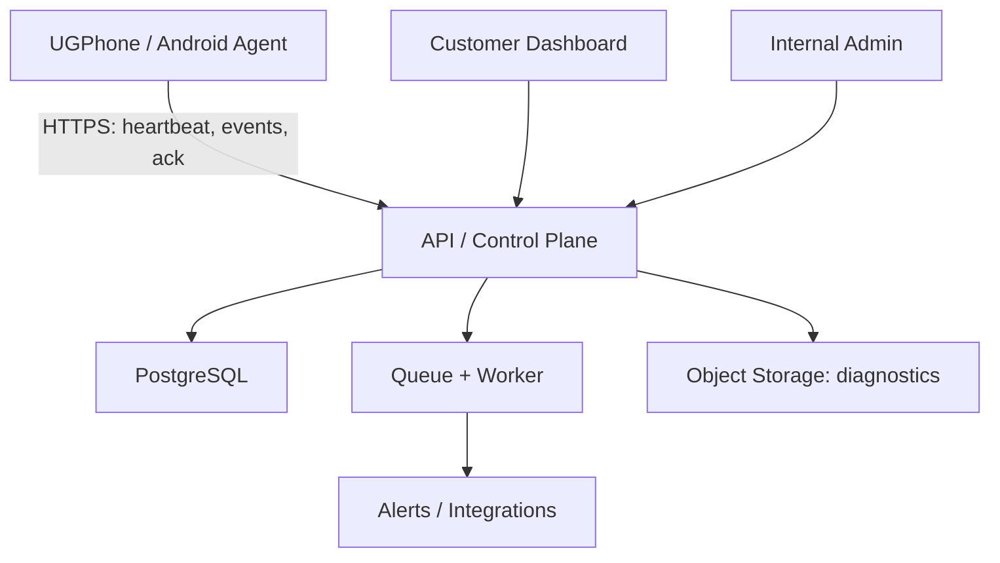
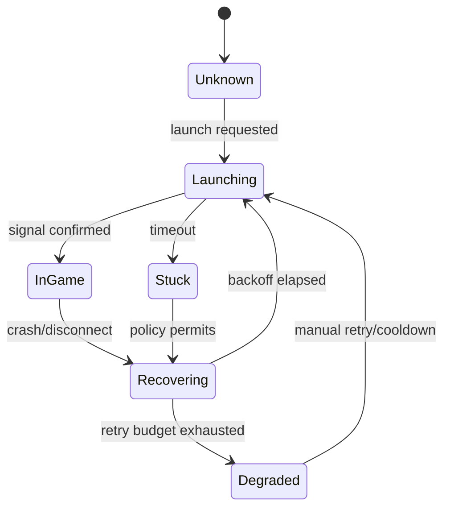

# Kế hoạch nâng cấp Auto Rejoin lên chuẩn Production

> Repository: `Gnas260605/auto-rejoin`  
> Baseline đã phân tích: commit `b232c3288f04160ddfb555f1dc54c07a58284c09` (`main`)  
> Ngày lập kế hoạch: 2026-08-11  
> Trạng thái tài liệu: Đề xuất kỹ thuật và kinh doanh để triển khai

## 1. Kết quả cần đạt

Chuyển dự án từ một bộ Bash script chạy độc lập trên Termux thành một sản phẩm quản lý thiết bị dạng SaaS gồm:

1. **Agent trên UGPhone/Android** chịu trách nhiệm kiểm tra phiên ứng dụng, khởi động lại, thu thập trạng thái và thực thi một tập lệnh an toàn đã định nghĩa trước.
2. **Control Plane trung tâm** quản lý tổ chức, người dùng, thiết bị, cấu hình, sự kiện, cảnh báo, phiên bản agent và gói dịch vụ.
3. **Dashboard khách hàng** để theo dõi thiết bị, xử lý sự cố, thay đổi policy và xem báo cáo.
4. **Dashboard nội bộ cho super-admin** để quản lý khách hàng, subscription, giới hạn sử dụng, hỗ trợ, audit và chống lạm dụng.
5. **Quy trình phát hành production** có CI/CD, kiểm thử, quan sát hệ thống, backup, rollback và phản ứng sự cố.

Mục tiêu không phải là viết lại toàn bộ ngay lập tức. Bản Bash hiện tại được harden để chạy pilot, sau đó agent mới được thay dần theo cơ chế tương thích ngược.

## 2. Phạm vi sản phẩm và cổng tuân thủ bắt buộc

### 2.1 Phạm vi được phép

- Theo dõi sức khỏe thiết bị và tiến trình ứng dụng trên thiết bị do khách hàng sở hữu hoặc được quyền quản lý.
- Phát hiện ứng dụng crash, mất mạng, treo ở màn hình tải và thực hiện restart theo policy.
- Gửi heartbeat, log kỹ thuật, metric và cảnh báo.
- Cho phép operator thực hiện các hành động đã được allowlist như restart app, restart agent, đồng bộ cấu hình và thu thập diagnostic bundle.
- Không yêu cầu hoặc lưu mật khẩu/cookie/session Roblox.

### 2.2 Ngoài phạm vi

- Không inject code, sửa client, exploit, cheat, bypass anti-cheat hoặc can thiệp traffic Roblox.
- Không cung cấp arbitrary remote shell từ dashboard.
- Không đọc credential, token đăng nhập hoặc dữ liệu riêng tư không cần thiết từ thư mục ứng dụng.
- Không tự động đăng nhập tài khoản, mua bán vật phẩm hoặc thực hiện gameplay.
- Không tuyên bố sản phẩm được Roblox bảo trợ hoặc liên kết chính thức.

### 2.3 Quyết định compliance trước khi thương mại hóa

Roblox cấm cheating/exploiting và cảnh báo việc dùng phần mềm làm thay đổi cách Roblox hoạt động. Điều khoản ứng dụng bên thứ ba cũng yêu cầu ứng dụng minh bạch, an toàn và không hỗ trợ cheat/exploit. Vì vậy:

- **Tắt `ANTI_AFK` mặc định ngay ở bản pilot.**
- Không đưa Anti-AFK vào gói trả phí trước khi có đánh giá pháp lý/policy bằng văn bản.
- Đổi định vị từ “bot Roblox” thành “cloud-device session reliability/monitoring”; không dùng Roblox trong tên thương hiệu hoặc logo.
- Thêm Acceptable Use Policy, Privacy Policy, Terms of Service, quy trình báo cáo lạm dụng và cơ chế khóa tenant/device.
- Mỗi release phải có checklist kiểm tra lại Roblox Terms/Community Standards và chính sách Android/nhà cung cấp cloud phone.

Nguồn chính thức cần dùng cho compliance gate:

- [Roblox: Anti-cheat Messages](https://en.help.roblox.com/hc/en-us/articles/24275616578708-Anti-cheat-Messages)
- [Roblox: Cheating and Exploiting](https://en.help.roblox.com/hc/en-us/articles/203312450-Cheating-and-Exploiting)
- [Roblox: Creator Third Party App Terms](https://en.help.roblox.com/hc/en-us/articles/15887203369620-Creator-Third-Party-App-Terms)

## 3. Đánh giá hiện trạng repository

### 3.1 Điểm mạnh có thể giữ lại

- Có logic phát hiện nhiều package clone và cấu hình riêng theo package.
- Hỗ trợ `su`, ADB và direct mode.
- Có grace period, phát hiện crash, stuck lobby, disconnect từ log, restart định kỳ và watchdog.
- Có tmux orchestration, log cục bộ, Discord webhook và menu CLI.
- Đã tối ưu việc dùng chung kết quả `dumpsys` để giảm tải khi chạy nhiều account.

### 3.2 Production gap

| Mảng          | Hiện trạng                               | Rủi ro                                     | Production target                                     |
| ------------- | ---------------------------------------- | ------------------------------------------ | ----------------------------------------------------- |
| Kiến trúc     | 2 Bash script, dữ liệu nằm trên từng máy | Không quản lý tập trung, khó scale/support | Agent + Control Plane + Web Dashboard                 |
| Cấu hình      | File shell được `source` trực tiếp       | Có thể thực thi code ngoài ý muốn          | JSON schema, validate chặt, atomic write              |
| Thực thi lệnh | Ghép chuỗi và dùng `eval`/`su -c`        | Command injection, quyền quá rộng          | Command allowlist, argv an toàn, least privilege      |
| Secrets       | Discord webhook lưu plain text           | Rò rỉ qua file, log, support bundle        | Mã hóa server-side, redaction, file permission `0600` |
| Telemetry     | Text log và file đếm rejoin              | Không truy vấn, không correlation, dễ race | Structured events, metric, trace/correlation ID       |
| Reliability   | Vòng lặp vô hạn, restart cố định         | Restart storm, rate limit, khó chẩn đoán   | Exponential backoff, jitter, circuit breaker          |
| Cập nhật      | `curl` tải script từ nhánh `main`        | Supply-chain risk, không rollback          | Signed release, checksum, channel, rollback           |
| Định danh     | Package/config là định danh chính        | Trùng, đổi package làm mất lịch sử         | UUID cho org/device/agent/session                     |
| Dashboard     | CLI/tmux cục bộ                          | Admin không quản lý từ xa                  | Customer portal + internal admin portal               |
| Multi-tenant  | Chưa có                                  | Không thể bán theo tổ chức/gói             | Tenant isolation, RBAC, entitlement                   |
| Billing       | Chưa có                                  | Không quản lý trial/plan/quota             | Subscription, usage meter, invoice state              |
| CI/CD         | Không có test/workflow/tag               | Regression cao                             | Lint, test, build, security scan, signed release      |
| Vận hành      | Không SLO/backup/incident process        | Không biết khi hệ thống hỏng               | SLO, alert, runbook, backup restore drill             |

### 3.3 Các vấn đề cụ thể cần xử lý trước pilot

| Ưu tiên | Vị trí hiện tại                              | Vấn đề                                                                            | Cách xử lý                                                                       |
| ------- | -------------------------------------------- | --------------------------------------------------------------------------------- | -------------------------------------------------------------------------------- |
| P0      | `setup.sh:102-103`                           | Dùng `local` ở top-level; lỗi runtime khi có package cần cài                      | Bỏ `local` hoặc đưa block vào function; thêm test nhánh fresh install            |
| P0      | `auto_rejoin.sh:85`                          | `source "$CONFIG_FILE"` có thể thực thi shell tùy ý                               | Đổi sang JSON và parser; trong giai đoạn chuyển tiếp chỉ đọc allowlist key/value |
| P0      | `auto_rejoin.sh:162-166`, `setup.sh:385-389` | `eval` và command string chạy qua `su`/ADB                                        | Xóa `eval`; mỗi action là function với argv được validate                        |
| P0      | `auto_rejoin.sh:52-58`                       | Payload Discord ghép JSON thủ công; quote/newline làm hỏng JSON hoặc chèn dữ liệu | Dùng `jq -n --arg`, timeout, retry có backoff và redaction                       |
| P0      | `auto_rejoin.sh:103-120`                     | Secret và input được ghi trực tiếp vào shell config                               | Schema validation, permission `0600`, tách secret khỏi config thường             |
| P0      | `setup.sh:119-138`, `README.md:10`           | Cài từ `main` qua `curl` không pin version/checksum/signature                     | Release immutable, SHA-256 + chữ ký, verify trước khi replace                    |
| P1      | `auto_rejoin.sh:172-223`                     | Quét username trong dữ liệu riêng của app bằng root                               | Loại khỏi default; dùng alias người vận hành nhập và consent rõ ràng             |
| P1      | `auto_rejoin.sh:373-376`                     | Internet health phụ thuộc IP public và HTTP Google                                | Kiểm tra API control plane qua HTTPS; phân biệt DNS/TLS/backend outage           |
| P1      | `auto_rejoin.sh:479-515`                     | Regex trên 150 dòng log có thể lặp lại cùng lỗi                                   | Lưu cursor/inode/offset và event fingerprint; debounce/deduplicate               |
| P1      | `auto_rejoin.sh:542-656`                     | Không exponential backoff/circuit breaker                                         | Giới hạn retry theo cửa sổ thời gian, jitter và trạng thái `DEGRADED`            |
| P1      | `auto_rejoin.sh:44-49`                       | Log tăng vô hạn                                                                   | Rotation theo kích thước/ngày, retention và disk quota                           |
| P1      | `auto_rejoin.sh:61-80`                       | Counter file không lock/atomic                                                    | SQLite cục bộ hoặc atomic rename + lock                                          |
| P1      | toàn repo                                    | Không `.gitignore` cho config/log/secret                                          | Thêm ignore rules và secret scanning                                             |
| P1      | toàn repo                                    | Không có automated test                                                           | ShellCheck, shfmt, Bats và device integration tests                              |
| P2      | `auto_rejoin.sh:440-475`                     | Phụ thuộc tên `GameActivity`                                                      | Detector theo adapter/version, fallback signal và confidence score               |

`bash -n` hiện pass cho cả hai script, nhưng kiểm tra này chỉ xác nhận cú pháp; nó không phát hiện lỗi `local` top-level, injection, race condition hoặc lỗi chỉ xuất hiện trên Android.

## 4. Mô hình sản phẩm và business

### 4.1 Nhóm khách hàng mục tiêu

1. Người vận hành 2–20 cloud phone muốn biết thiết bị nào offline mà không mở từng máy.
2. Nhóm vận hành 20–100 thiết bị cần phân quyền, policy dùng chung và báo cáo.
3. Đơn vị quản lý thiết bị số lượng lớn cần API, SSO, audit, SLA và hỗ trợ riêng.

Chỉ phục vụ use case hợp pháp và tuân thủ chính sách nền tảng. Không tối ưu sản phẩm cho gameplay automation hoặc lợi thế không công bằng.

### 4.2 Giá trị bán được

- Giảm thời gian kiểm tra thiết bị thủ công.
- Rút ngắn thời gian từ khi crash đến khi được phát hiện/khôi phục.
- Quản lý cấu hình và phiên bản đồng nhất cho nhiều thiết bị.
- Có lịch sử sự cố, bằng chứng vận hành và báo cáo uptime.
- Giảm support nhờ diagnostic bundle và remote action an toàn.

### 4.3 Giả thuyết gói dịch vụ để thử nghiệm

Giá dưới đây là giả thuyết ban đầu, phải được kiểm chứng qua phỏng vấn và willingness-to-pay; chưa phải bảng giá chính thức.

| Gói      |       Giá gợi ý | Entitlement chính                                                 | Mục tiêu                  |
| -------- | --------------: | ----------------------------------------------------------------- | ------------------------- |
| Free     |             0 đ | 1 thiết bị, 24 giờ lịch sử, 1 thành viên                          | Kích hoạt và thử sản phẩm |
| Pro      |  20.000 đ/tháng | 5 thiết bị, 7 ngày lịch sử, cảnh báo Discord                      | Cá nhân vận hành nhỏ      |
| Team     | 100.000 đ/tháng | 50 thiết bị, 30 ngày lịch sử, 5 thành viên, RBAC, policy template | Nhóm vận hành             |
| Business |         Báo giá | 200+ thiết bị, 90 ngày, SSO, API, audit export, SLA               | Doanh nghiệp              |

Quy tắc billing:

- Subscription gắn với organization, không gắn với từng user.
- Mỗi plan ánh xạ thành entitlement: `device_limit`, `seat_limit`, `retention_days`, `api_access`, `sso_enabled`.
- Có trial, grace period, past-due và suspended state.
- Không xóa dữ liệu ngay khi quá hạn; chuyển read-only theo retention policy.
- Webhook thanh toán phải idempotent và được verify signature.
- Tách billing state khỏi quyền kỹ thuật; backend kiểm tra entitlement tại server, không tin UI.

### 4.4 KPI kinh doanh và sản phẩm

| Nhóm        | KPI                         | Định nghĩa ban đầu                                           |
| ----------- | --------------------------- | ------------------------------------------------------------ |
| Activation  | Activated organization      | Tạo org + enroll thiết bị + nhận heartbeat đầu trong 15 phút |
| Reliability | Monitored device uptime     | Tỷ lệ thời gian agent gửi heartbeat đúng hạn                 |
| Outcome     | Recovery success rate       | Recovery thành công / tổng recovery attempt                  |
| Speed       | MTTD                        | Từ sự cố đến event được ghi nhận                             |
| Speed       | MTTR                        | Từ sự cố đến trạng thái healthy                              |
| Engagement  | Weekly active organizations | Org có ít nhất một user xem dashboard hoặc action hợp lệ     |
| Revenue     | Trial-to-paid conversion    | Org trial chuyển paid trong cửa sổ đo                        |
| Retention   | Logo churn / device churn   | Churn theo org và số device quản lý                          |
| Cost        | Telemetry cost/device       | Tổng chi phí ingest, storage, alert trên thiết bị            |
| Support     | Tickets/100 devices         | Khối lượng support chuẩn hóa theo quy mô                     |

## 5. Kiến trúc mục tiêu



### 5.1 Nguyên tắc kiến trúc

- **Modular monolith trước, microservices sau.** Một API service có module rõ ràng đủ cho MVP và dễ vận hành hơn.
- Agent chỉ tạo kết nối outbound HTTPS; không mở cổng inbound trên cloud phone.
- Dashboard không giao tiếp trực tiếp với agent.
- Server lưu `desired_state`; agent báo `reported_state`. Thay đổi cấu hình có version và khả năng rollback.
- Event append-only; trạng thái tổng hợp được cập nhật riêng để dashboard đọc nhanh.
- Redis/queue chỉ đưa vào khi cần background job, rate limit phân tán hoặc fan-out lớn; không bắt buộc cho tuần đầu.

### 5.2 Công nghệ khuyến nghị

| Thành phần                  | Chọn                                                            | Lý do                                                                           |
| --------------------------- | --------------------------------------------------------------- | ------------------------------------------------------------------------------- |
| Agent pilot                 | Bash đã harden                                                  | Tái sử dụng logic thiết bị và kiểm chứng thị trường nhanh                       |
| Agent production            | Go single binary + shell adapter nhỏ                            | Cross-compile ARM64, typed config, concurrency, test và update an toàn hơn Bash |
| Android companion tương lai | Kotlin                                                          | Dùng khi cần UI/permission lifecycle native và phân phối APK                    |
| Backend                     | TypeScript + Fastify theo modular monolith                      | Nhẹ, typed contract, dễ dùng chung schema với dashboard                         |
| Dashboard                   | Next.js + TypeScript                                            | Routing, SSR, auth integration và hệ sinh thái UI tốt                           |
| Database                    | PostgreSQL                                                      | Transaction, relational model, JSONB và audit/query tốt                         |
| Queue                       | PostgreSQL job table lúc MVP; Redis/BullMQ khi tải tăng         | Giảm hạ tầng sớm, vẫn có đường scale                                            |
| Object storage              | S3-compatible                                                   | Diagnostic bundle, export và retention lifecycle                                |
| Observability               | OpenTelemetry + Prometheus-compatible metrics + structured logs | Chuẩn hóa correlation và tránh lock-in                                          |
| Infrastructure              | Container image + managed PostgreSQL + IaC                      | Release nhất quán, backup và rollback rõ ràng                                   |

## 6. Domain model và database

Mọi bảng multi-tenant phải có `organization_id` và index phù hợp. Authorization luôn kiểm tra organization ở backend.

| Entity               | Trường quan trọng                                                         | Ghi chú                                           |
| -------------------- | ------------------------------------------------------------------------- | ------------------------------------------------- |
| `organizations`      | `id`, `name`, `slug`, `status`, `plan_id`                                 | Tenant gốc                                        |
| `users`              | `id`, `email`, `status`, `last_login_at`                                  | Không chứa password nếu dùng IdP/OIDC             |
| `memberships`        | `org_id`, `user_id`, `role`                                               | `owner`, `admin`, `operator`, `viewer`, `billing` |
| `devices`            | `id`, `org_id`, `name`, `platform`, `status`, `last_seen_at`              | Một cloud phone vật lý/ảo                         |
| `agents`             | `id`, `device_id`, `version`, `install_id`, `public_key`, `channel`       | Một cài đặt agent                                 |
| `app_instances`      | `id`, `device_id`, `package_name`, `alias`, `enabled`                     | Không lưu Roblox credential                       |
| `policies`           | `id`, `org_id`, `name`, `version`, `config_json`                          | Policy có version                                 |
| `policy_assignments` | `policy_id`, `device_id/app_instance_id`                                  | Desired configuration                             |
| `heartbeats`         | `agent_id`, `received_at`, `state_json`                                   | Partition/retention khi dữ liệu lớn               |
| `events`             | `id`, `org_id`, `device_id`, `type`, `severity`, `occurred_at`, `payload` | Append-only, có dedupe key                        |
| `incidents`          | `id`, `status`, `opened_at`, `resolved_at`, `root_cause`                  | Gom nhiều event liên quan                         |
| `commands`           | `id`, `agent_id`, `type`, `payload`, `state`, `expires_at`                | Không có `shell` command                          |
| `command_attempts`   | `command_id`, `attempt`, `acked_at`, `result_code`                        | Idempotency và retry audit                        |
| `alert_rules`        | `id`, `org_id`, `condition`, `channels`, `cooldown`                       | Tránh alert storm                                 |
| `integrations`       | `id`, `type`, `encrypted_secret`, `status`                                | Secret mã hóa và redacted                         |
| `audit_logs`         | `actor`, `action`, `target`, `before`, `after`, `ip`, `created_at`        | Append-only, không cho sửa qua UI                 |
| `plans`              | `id`, `code`, `entitlements_json`                                         | Product catalog nội bộ                            |
| `subscriptions`      | `org_id`, `provider_ref`, `status`, `period_end`                          | Billing state                                     |
| `usage_counters`     | `org_id`, `metric`, `period`, `quantity`                                  | Quota và báo cáo                                  |
| `agent_releases`     | `version`, `channel`, `artifact`, `checksum`, `signature`                 | Rollout/rollback                                  |
| `feature_flags`      | `key`, `scope`, `value`, `expires_at`                                     | Kill switch và staged rollout                     |

Các constraint bắt buộc:

- Unique `(organization_id, device.name)` theo rule đã chọn.
- Unique `agents.install_id` và rotate credential khi re-enroll.
- `commands.idempotency_key` unique theo agent.
- `events.dedupe_key` unique trong time bucket phù hợp.
- Foreign key đầy đủ, soft-delete có chủ đích; audit log không soft-delete.
- Timestamp lưu UTC; UI render theo timezone organization/user.

## 7. Giao thức agent và API

### 7.1 Enrollment

1. Admin tạo enrollment code một lần, hết hạn sau 10 phút.
2. Agent tạo key pair cục bộ.
3. Agent gửi code + public key + device metadata tối thiểu.
4. Server tạo `device_id`, `agent_id`, cấp credential device-scoped.
5. Agent lưu secret với permission `0600`; server chỉ lưu bản hash hoặc encrypted material cần thiết.
6. Mọi lần re-enroll/revoke đều ghi audit log.

### 7.2 Endpoint MVP

| Method | Endpoint                      | Mục đích                                           |
| ------ | ----------------------------- | -------------------------------------------------- |
| `POST` | `/v1/agent/enroll`            | Enroll thiết bị bằng one-time code                 |
| `POST` | `/v1/agent/heartbeat`         | Gửi trạng thái tổng hợp và nhận config version mới |
| `POST` | `/v1/agent/events:batch`      | Ingest event theo batch, idempotent                |
| `GET`  | `/v1/agent/commands?after=`   | Long-poll command, không cần inbound port          |
| `POST` | `/v1/agent/commands/{id}/ack` | Ack/start/result command                           |
| `GET`  | `/v1/agent/releases/latest`   | Lấy metadata release theo channel                  |
| `GET`  | `/v1/devices`                 | Danh sách thiết bị theo tenant                     |
| `GET`  | `/v1/devices/{id}`            | Detail, state, timeline, incidents                 |
| `POST` | `/v1/devices/{id}/commands`   | Tạo allowlisted command                            |
| `PUT`  | `/v1/policies/{id}`           | Tạo version policy mới                             |
| `GET`  | `/v1/incidents`               | Incident list/filter/export                        |
| `GET`  | `/v1/audit-logs`              | Audit theo quyền                                   |
| `GET`  | `/v1/billing/entitlements`    | Trả quyền và quota effective                       |

### 7.3 Heartbeat tối thiểu

```json
{
  "schema_version": 1,
  "message_id": "01J...",
  "sent_at": "2026-08-11T06:30:00Z",
  "device_id": "dev_...",
  "agent": {
    "version": "3.2.0",
    "uptime_seconds": 86400,
    "executor": "adb"
  },
  "device": {
    "network": "online",
    "disk_free_bytes": 1073741824
  },
  "instances": [
    {
      "instance_id": "app_...",
      "package_name": "com.roblox.client",
      "state": "in_game",
      "last_transition_at": "2026-08-11T06:29:22Z",
      "rejoin_count_24h": 2
    }
  ],
  "reported_policy_version": 12
}
```

Không gửi username thật nếu alias đủ cho mục đích quản lý. Payload phải có size limit, schema version và server-side validation.

### 7.4 Command allowlist

Chỉ hỗ trợ các command typed:

- `restart_app`
- `start_app`
- `stop_app`
- `restart_agent`
- `sync_policy`
- `collect_diagnostics`
- `update_agent`
- `rotate_credential`

Mỗi command có `id`, `type`, payload schema, `expires_at`, idempotency key và actor. Không bao giờ có field `command`, `script` hoặc `shell` do admin tự nhập.

## 8. State machine của agent

Trạng thái app instance:



Yêu cầu:

- Mọi transition tạo một structured event.
- Signal detector trả cả `state` và `confidence`; không giả định duy nhất `GameActivity`.
- Retry budget ví dụ tối đa 5 lần/15 phút, exponential backoff có jitter.
- Khi vượt budget, chuyển `DEGRADED`, dừng restart storm và cảnh báo operator.
- Sau một khoảng healthy đủ dài mới reset retry budget.
- Các timer dùng monotonic clock nếu runtime hỗ trợ.

## 9. Dashboard khách hàng

### 9.1 Trang Overview

- Tổng thiết bị: healthy, degraded, offline, maintenance.
- Tổng app instance online/in-game.
- Incident mở, recovery thành công, MTTD, MTTR trong 24 giờ/7 ngày/30 ngày.
- Agent version distribution và thiết bị cần update.
- Timeline sự cố gần nhất.
- Quota hiện tại so với plan.

### 9.2 Trang Devices

- Bảng filter theo status, group, version, last seen, policy.
- Bulk assign policy, bulk update agent, maintenance mode.
- Device detail gồm app instances, heartbeat, tài nguyên, event timeline, command history.
- Action nguy hiểm phải có confirm, reason và audit.
- Offline status được tính server-side, ví dụ `last_seen_at > 2 × heartbeat interval + grace`.

### 9.3 Trang Incidents

- Nhóm event trùng theo device/app/reason/time window.
- Severity, owner, trạng thái, acknowledge/resolve, note và root cause.
- Deep link đến log đã redacted và command liên quan.
- Export CSV/JSON theo entitlement.

### 9.4 Trang Policies

- Template: conservative, balanced, aggressive-recovery.
- Form có validation và giải thích tác động.
- Preview diff, staged rollout theo nhóm thiết bị.
- Rollback về version trước.
- Những tính năng nhạy cảm/policy-risk không hiển thị nếu chưa được compliance cho phép.

### 9.5 Trang Alerts & Integrations

- Discord webhook, email và generic webhook theo phase.
- Nút test integration không hiển thị full secret.
- Cooldown, grouping, quiet hours và escalation.
- Alert delivery log nhưng redacted payload.

### 9.6 Trang Team & Billing

- Invite, revoke, đổi role; owner transfer có step-up authentication.
- Plan, usage, renewal, invoice và payment state.
- Billing admin không tự động có quyền điều khiển thiết bị.

## 10. Dashboard nội bộ cho super-admin

Dashboard nội bộ phải là application/route tách biệt, yêu cầu MFA và quyền hẹp hơn theo vai trò support, finance, security và platform admin.

### 10.1 Chức năng

- Organizations: trạng thái, plan, usage, health, risk flag, retention.
- Users: trạng thái đăng nhập, membership; không xem secret.
- Fleet: tổng thiết bị, agent version, heartbeat lag, crash loop, update rollout.
- Subscriptions: trial, active, past due, grace, suspended, invoice webhook failures.
- Entitlements: override có thời hạn, lý do và approver.
- Releases: channel, rollout percentage, pause/rollback/kill switch.
- Abuse: velocity bất thường, số device tăng đột biến, restart storm, AUP report.
- Support: diagnostic metadata đã redacted, case link, action có consent.
- Audit: tìm kiếm theo actor/action/tenant/target/time.
- Platform health: API latency, ingest lag, queue depth, error budget.

### 10.2 Guardrail

- Không có “login as customer” không kiểm soát. Nếu cần support access: just-in-time, read-only mặc định, có consent, lý do, TTL và audit.
- Không hiển thị raw device credential, webhook secret hoặc private server code.
- Export dữ liệu yêu cầu quyền riêng và audit.
- Hard delete, tenant suspension, entitlement override và global rollout cần xác nhận hai bước; thao tác rủi ro cao nên có dual approval khi quy mô tăng.

## 11. Security baseline

Áp dụng [OWASP ASVS](https://owasp.org/www-project-application-security-verification-standard/) cho web/backend và [OWASP MASVS](https://mas.owasp.org/MASVS/) nếu phát hành Android companion app.

### 11.1 Authentication và authorization

- User auth qua OIDC; MFA bắt buộc cho owner, internal admin và action nhạy cảm.
- Session cookie `HttpOnly`, `Secure`, `SameSite`; rotate refresh token.
- RBAC ở backend; deny-by-default; object-level authorization trên mọi ID.
- Device credential chỉ dùng cho endpoint agent và scope đúng `agent_id`.
- Credential rotation/revocation không yêu cầu cài lại toàn hệ thống.

### 11.2 Secrets và dữ liệu

- Mã hóa secret bằng envelope encryption/KMS; không lưu plain text trong config chung.
- Redact webhook, enrollment code, authorization header, private code khỏi log và diagnostic.
- File local nhạy cảm `0600`, thư mục runtime `0700`, `umask 077`.
- Data minimization: không thu thập Roblox credential; username chỉ là alias tùy chọn.
- Retention tự động theo plan và chính sách riêng tư.

### 11.3 Agent và command execution

- Loại bỏ `eval`, `source` config không tin cậy và ghép command string.
- Validate package name bằng regex allowlist, Place ID là số dương, tọa độ/interval có min-max.
- Không expose ADB ra Internet; Android yêu cầu xác thực key/pairing. Tham khảo [Android Debug Bridge](https://developer.android.com/tools/adb) và [Android permission best practices](https://developer.android.com/training/permissions/usage-notes).
- Ưu tiên quyền tối thiểu; root mode là optional, hiển thị cảnh báo và capability cụ thể.
- Diagnostic bundle dùng allowlist file, giới hạn kích thước, redact trước upload.

### 11.4 Supply chain

- Release theo SemVer, tag immutable.
- CI tạo artifact, checksum, SBOM và chữ ký; agent verify trước khi update.
- Staged rollout: canary 1% → 10% → 50% → 100%, tự pause khi error rate vượt ngưỡng.
- Giữ ít nhất một bản last-known-good để rollback offline.
- Dependabot/Renovate, dependency lockfile, secret scan, SAST và container scan.

### 11.5 Audit và privacy

- Audit append-only cho login, role, config, command, export, billing override, release.
- Security log có actor, tenant, action, target, outcome, timestamp, request/correlation ID; không chứa secret. Tham khảo [OWASP Logging Cheat Sheet](https://cheatsheetseries.owasp.org/cheatsheets/Logging_Cheat_Sheet.html).
- Có quy trình data export/delete, incident notification và xử lý yêu cầu riêng tư.

## 12. Hardening bản agent Bash cho pilot

### 12.1 Cấu trúc runtime đề xuất

```text
~/.auto-rejoin/
├── bin/auto-rejoin
├── config/config.json
├── secrets/device-token
├── state/state.json
├── logs/agent.jsonl
├── run/agent.pid
└── releases/3.2.0/
```

### 12.2 Thay đổi bắt buộc

- Dùng `set -Eeuo pipefail`, `IFS` an toàn và error trap có mã lỗi.
- Resolve mọi path từ `SCRIPT_DIR`, không phụ thuộc working directory.
- Dùng process lock (`flock` hoặc mkdir lock fallback) để không chạy trùng agent.
- Config JSON có schema; không `source` file.
- Atomic write bằng file tạm cùng filesystem + `mv`.
- Log JSON Lines có rotation, max disk usage và redaction.
- `curl --fail --show-error --connect-timeout --max-time` + retry chỉ cho lỗi retryable.
- Không ghép JSON bằng string interpolation.
- Mỗi event có UUID/ULID, timestamp, device/app ID, type, severity, dedupe key.
- Watchdog có restart budget và cooldown.
- Signal handler đảm bảo cleanup PID/lock, nhưng không xóa bằng path chưa validate.
- Self-update chỉ nhận release đã pin/checksum/signature; update atomic và rollback.
- Giữ offline queue giới hạn dung lượng; gửi batch khi có mạng và loại bỏ theo retention.

### 12.3 Config schema gợi ý

```json
{
  "schema_version": 1,
  "agent": {
    "heartbeat_seconds": 30,
    "release_channel": "stable"
  },
  "instances": [
    {
      "id": "local-app-1",
      "package_name": "com.roblox.client",
      "place_id": "2753915549",
      "enabled": true,
      "health_check_seconds": 30,
      "restart": {
        "enabled": true,
        "period_seconds": 7200,
        "max_attempts": 5,
        "window_seconds": 900
      }
    }
  ]
}
```

`private_code` và integration secret không nằm trong file này nếu có thể tránh; chúng nằm ở secret store/file riêng và chỉ được tham chiếu bằng ID.

## 13. Observability, SLO và vận hành

### 13.1 SLI/SLO ban đầu

| SLI                        |                           SLO pilot | Cách đo                           |
| -------------------------- | ----------------------------------: | --------------------------------- |
| Control Plane availability |                         99,9%/tháng | Successful non-5xx requests       |
| Heartbeat ingest success   |                               99,9% | Accepted / attempted hợp lệ       |
| Heartbeat freshness        |              95% thiết bị < 90 giây | `now - last_seen_at`              |
| Crash detection latency    |                       p95 < 60 giây | `detected_at - inferred_crash_at` |
| Command delivery           |      p95 < 30 giây khi agent online | `acked_at - created_at`           |
| Dashboard load             |                        p95 < 2 giây | Web vital/API query latency       |
| Recovery success           |    Theo baseline, sau đó đặt target | Successful / attempted recovery   |
| Backup restore             | RPO ≤ 24 giờ, RTO ≤ 4 giờ lúc pilot | Restore drill hàng quý            |

Không hứa SLA thương mại cho đến khi có ít nhất 30 ngày dữ liệu production và restore drill thành công.

### 13.2 Metric cần có

- `agent_heartbeat_age_seconds`
- `agent_event_queue_depth`
- `app_state_transitions_total{from,to}`
- `app_recovery_attempts_total{reason,result}`
- `command_duration_seconds{type,result}`
- `api_request_duration_seconds{route,status}`
- `event_ingest_rejected_total{reason}`
- `alert_delivery_total{channel,result}`
- `billing_webhook_total{type,result}`
- `release_rollout_devices{version,state}`

### 13.3 Runbook tối thiểu

- API 5xx tăng.
- Heartbeat ingest lag.
- Nhiều thiết bị offline cùng lúc.
- Restart storm theo version/policy.
- Database storage/connection saturation.
- Billing webhook lỗi.
- Agent release lỗi và rollback.
- Secret/credential nghi bị lộ.
- Data export/delete request.

## 14. Cấu trúc repository mục tiêu

```text
auto-rejoin/
├── apps/
│   ├── web/                 # Customer dashboard
│   └── admin/               # Internal admin
├── services/
│   ├── api/                 # Modular monolith
│   └── worker/              # Alert, export, scheduled jobs
├── agents/
│   ├── termux-legacy/       # Bash v3.2 hardened
│   └── termux-go/           # Agent v4
├── packages/
│   ├── contracts/           # API/event schema
│   ├── authz/               # RBAC/entitlement rules
│   └── ui/                  # Shared UI components
├── infra/
│   ├── containers/
│   ├── terraform/
│   └── monitoring/
├── docs/
│   ├── architecture/
│   ├── runbooks/
│   ├── api/
│   └── compliance/
├── tests/
│   ├── integration/
│   ├── e2e/
│   └── device-lab/
├── .github/workflows/
├── SECURITY.md
├── CONTRIBUTING.md
├── LICENSE
└── README.md
```

Giữ API contract và event schema trong package dùng chung; thay đổi breaking phải tăng `schema_version` và có migration window.

## 15. CI/CD và môi trường

### 15.1 Environments

- **Local:** database/container local, mock agent.
- **Staging:** auth, billing sandbox, device lab, dữ liệu giả.
- **Production:** account/project riêng, secret riêng, backup, audit và least privilege.

Không dùng production credential trong local/staging.

### 15.2 Pipeline pull request

1. Format/lint: ShellCheck, shfmt, ESLint.
2. Unit test: Bats, backend, frontend.
3. Contract/schema compatibility test.
4. Integration test với PostgreSQL.
5. Security: secret scan, dependency scan, SAST.
6. Build container/agent artifacts reproducibly.
7. E2E dashboard bằng Playwright.
8. Preview/staging deploy và smoke test.

### 15.3 Pipeline release

1. Tag SemVer từ commit đã review.
2. Build ARM64 agent và container.
3. Tạo checksum, SBOM, signature và release notes.
4. Deploy backend theo rolling/blue-green.
5. Migration database backward-compatible; không xóa cột trong cùng release.
6. Canary agent rollout, theo dõi error budget.
7. Promote hoặc rollback tự động/theo phê duyệt.

## 16. Chiến lược kiểm thử

### 16.1 Agent

- Unit test config validation, state transition, backoff, event serialization.
- Bats test cho adapter shell và migration config v3.1 → v3.2.
- Device matrix: Android/UGPhone version, root/no-root, ADB/direct, 1/5/20 clones.
- Fault injection: mất mạng, DNS lỗi, API timeout, Roblox crash, stale log, disk full, clock skew, process kill, reboot.
- Soak test 72 giờ và 7 ngày; kiểm tra CPU, RAM, disk growth, restart count.

### 16.2 Backend và dashboard

- Tenant isolation và object-level authorization test.
- Idempotency cho heartbeat/event/command/billing webhook.
- Race test khi hai admin sửa cùng policy.
- Load test ingest theo ít nhất 2× quy mô dự kiến 6 tháng.
- E2E: enroll → heartbeat → incident → command → resolved.
- Accessibility, responsive layout và timezone tests.

### 16.3 Security

- Threat model trước public beta.
- Test command injection trên mọi input từ config/dashboard.
- Verify log/diagnostic không chứa secret.
- Dependency/container scan ở mỗi release.
- Pen-test trước khi bán gói Business hoặc mở public API.

## 17. Lộ trình triển khai đề xuất

### Phase 0 — 3 đến 5 ngày: ổn định repository hiện tại

- Sửa tất cả P0 trong mục 3.3.
- Thêm `.gitignore`, `LICENSE`, `SECURITY.md`, `CHANGELOG.md`.
- Thêm ShellCheck, shfmt, Bats và CI.
- Chuẩn hóa version `3.2.0` và release artifact có checksum.
- Tắt Anti-AFK mặc định; thêm compliance notice.
- Định nghĩa event/config JSON schema v1.

**Exit criteria:** fresh install test pass trên root và no-root; không còn `eval`/unsafe config source; không secret trong log; có rollback release.

### Phase 1 — Tuần 2: agent telemetry MVP

- Agent ID/device ID và one-time enrollment.
- Heartbeat, event offline queue, batch upload.
- Structured log, retry budget, circuit breaker.
- Mock control plane để test 20 thiết bị.

**Exit criteria:** chạy soak 72 giờ; mất mạng không mất dữ liệu quan trọng và không restart storm.

### Phase 2 — Tuần 3–4: Control Plane MVP

- Auth/OIDC, organizations, memberships, RBAC.
- Device/app instance registry, heartbeat/event ingest.
- Desired/reported policy version.
- Command allowlist và audit log.

**Exit criteria:** tenant isolation integration test pass; enroll-to-command E2E pass; backup và restore test pass.

### Phase 3 — Tuần 5: Customer Dashboard

- Overview, Devices, Detail, Incidents, Policies, Alerts.
- Responsive UI, filter, bulk action, error/empty/loading states.
- Discord integration được mã hóa và redacted.

**Exit criteria:** operator quản lý 50 thiết bị không cần tmux; action nhạy cảm có audit/confirmation.

### Phase 4 — Tuần 6: Business và Internal Admin

- Plan/entitlement, trial, usage counter, billing sandbox.
- Organization/user/fleet/release/support/abuse views.
- Feature flag, kill switch, staged rollout.

**Exit criteria:** quota không bypass qua API; billing webhook idempotent; support access có TTL/consent/audit.

### Phase 5 — Tuần 7–8: Production readiness và closed beta

- Load/security/chaos test, SLO dashboard, on-call runbook.
- Privacy/AUP/Terms, compliance review và deletion/export flow.
- Canary với 5 khách hàng/50–100 thiết bị.
- Đo activation, heartbeat freshness, recovery success, support load và WTP.

**Exit criteria:** 14 ngày beta ổn định, không P0/P1 mở, restore drill đạt RPO/RTO, có quyết định go/no-go thương mại hóa.

## 18. Migration từ v3.1

1. Backup config/log/stats hiện tại tại thiết bị; không upload secret mặc định.
2. Cài v3.2 song song vào versioned directory.
3. Migrator đọc đúng các key allowlist từ config cũ, validate và ghi JSON mới.
4. Tạo alias app instance từ package; không coi username là identity.
5. Enroll device và chạy chế độ telemetry-only trước.
6. So sánh trạng thái local và dashboard trong 24 giờ.
7. Bật remote policy/command theo từng nhóm canary.
8. Giữ bản v3.1 last-known-good và lệnh rollback.
9. Chỉ xóa config cũ sau thời gian ổn định và xác nhận của operator.

Migration phải idempotent: chạy lại không nhân đôi device/app instance và không ghi đè secret mới.

## 19. Definition of Done cho production

Một release chỉ được coi là production-ready khi:

- Không còn P0/P1 security/reliability issue chưa có risk acceptance.
- Test unit/integration/E2E/device matrix bắt buộc pass.
- Có migration và rollback đã được thử trên staging.
- API, event và config schema có version/documentation.
- Dashboard kiểm tra quyền ở backend, không chỉ ẩn nút ở frontend.
- Không có secret/PII nhạy cảm trong log, metric, trace, diagnostic bundle.
- SLO, alert và runbook đã hoạt động; on-call biết cách rollback.
- Backup restore drill pass.
- Release agent/container có checksum, SBOM và signature.
- Changelog, security notes và known issues hoàn tất.
- Compliance gate mục 2 được review, đặc biệt khi thay đổi automation behavior.

## 20. Risk register

| Risk                                  | Xác suất           | Tác động       | Mitigation                                                            |
| ------------------------------------- | ------------------ | -------------- | --------------------------------------------------------------------- |
| Vi phạm policy Roblox/experience      | Cao                | Rất cao        | Tắt Anti-AFK, AUP, compliance gate, không exploit/gameplay automation |
| Root/ADB bị lạm dụng                  | Trung bình         | Rất cao        | Least privilege, outbound-only, typed commands, no remote shell       |
| Supply-chain qua installer/update     | Cao ở bản hiện tại | Rất cao        | Signed immutable releases, checksum, rollback                         |
| Tenant data leak                      | Trung bình         | Rất cao        | Org-scoped authz, integration test, audit, DB constraints             |
| Restart storm                         | Cao ở bản hiện tại | Cao            | Retry budget, exponential backoff, circuit breaker, kill switch       |
| Chi phí telemetry tăng                | Trung bình         | Cao            | Batch, sampling, retention tier, per-device cost KPI                  |
| False positive detector               | Cao                | Trung bình/Cao | Multi-signal confidence, dedupe, manual override, device matrix       |
| UGPhone/Android thay đổi behavior     | Trung bình         | Cao            | Adapter layer, compatibility matrix, staged rollout                   |
| Thanh toán nhưng dịch vụ chưa ổn định | Trung bình         | Cao            | Closed beta, 30 ngày metrics trước SLA, grace/refund process          |
| Secret lọt vào support bundle         | Trung bình         | Cao            | Allowlist + redaction test + size/type limits                         |

## 21. 15 issue đầu tiên nên tạo trên GitHub

1. `fix(setup): remove top-level local declarations and add fresh-install test`
2. `security(agent): replace sourced shell config with validated JSON schema`
3. `security(agent): remove eval and implement typed command adapter`
4. `security(alerts): encode Discord payload and redact webhook secret`
5. `reliability(agent): add retry budget, exponential backoff and circuit breaker`
6. `observability(agent): emit versioned JSONL events with correlation IDs`
7. `reliability(agent): add log rotation and atomic local state`
8. `release: build immutable v3.2.0 artifact with checksum and rollback`
9. `ci: add ShellCheck, shfmt, Bats and secret scanning`
10. `compliance: disable Anti-AFK by default and add acceptable-use notice`
11. `api: implement organization, user, membership and RBAC foundation`
12. `api: implement device enrollment, heartbeat and event batch ingest`
13. `api: implement typed command lifecycle and audit logging`
14. `web: build fleet overview and device detail dashboard`
15. `admin: build tenant, entitlement, release and abuse-control views`

Mỗi issue phải có acceptance criteria, test plan, security impact và rollback note. Không bắt đầu dashboard bằng dữ liệu giả không có contract; hoàn thành event/API schema trước để tránh phải viết lại UI.

## 22. Quyết định nên chốt ngay

| Quyết định                    | Khuyến nghị                                                                   |
| ----------------------------- | ----------------------------------------------------------------------------- |
| Có viết lại Bash ngay không?  | Không; harden v3.2 để pilot, viết Go v4 sau khi contract ổn định              |
| Monolith hay microservices?   | Modular monolith đến khi có bottleneck đo được                                |
| WebSocket hay polling?        | HTTPS long-poll/heartbeat cho MVP; đánh giá MQTT/WebSocket khi quy mô yêu cầu |
| Có lưu username Roblox không? | Chỉ alias tự nhập; không root-scan mặc định                                   |
| Có bán Anti-AFK không?        | Không trước compliance/legal review                                           |
| Có remote shell không?        | Không, kể cả super-admin                                                      |
| Billing khi nào?              | Sau khi core reliability và tenant isolation đã pass; dùng sandbox ở Phase 4  |
| Public beta khi nào?          | Sau closed beta 14 ngày, không P0/P1 và restore drill thành công              |

---

### Kết luận

Ưu tiên đúng là **bảo mật và reliability của agent trước, contract/API sau, dashboard tiếp theo, billing cuối cùng**. Nếu chỉ dựng dashboard lên trên hai Bash script hiện tại, hệ thống sẽ trông chuyên nghiệp nhưng vẫn mang rủi ro command injection, secret leak, restart storm và không thể hỗ trợ nhiều tenant an toàn.

Mốc sản phẩm hợp lý đầu tiên là: một operator enroll 10 thiết bị, xem trạng thái tập trung, nhận incident, thực hiện một command allowlisted, xem audit trail và rollback agent mà không cần truy cập từng tmux. Khi luồng này chạy ổn định và compliance gate đã pass, mới mở rộng subscription và thương mại hóa.
