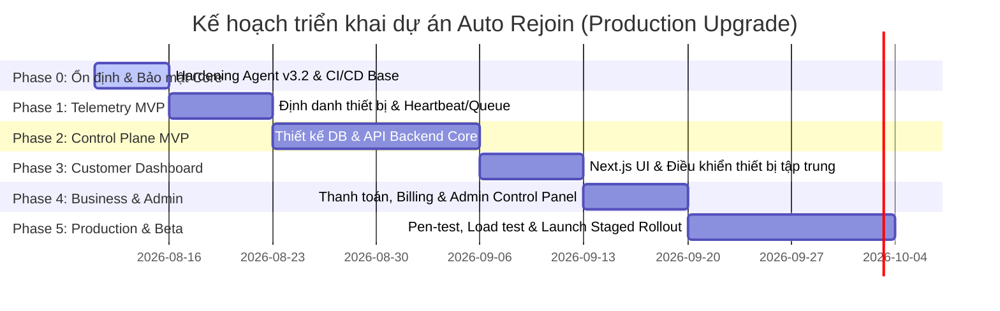

# Lộ trình nâng cấp hệ thống Auto Rejoin lên chuẩn Production (Project Roadmap)

Hệ thống quản lý độ tin cậy phiên chạy ứng dụng (Session Reliability System) cho Android/Roblox, chuyển đổi từ công cụ chạy Bash script độc lập trên từng máy sang nền tảng SaaS quản lý tập trung đa tổ chức (Multi-tenant Enterprise SaaS).



---

## 🎯 Tổng quan các Phase triển khai

| Phase | Thời gian dự kiến | Mục tiêu trọng tâm | Trạng thái |
| :--- | :---: | :--- | :---: |
| **Phase 0** | 3 - 5 ngày | Khắc phục lỗ hổng bảo mật P0/P1, loại bỏ `eval`, đóng gói bản Agent v3.2 ổn định để pilot. | ⏳ Sắp chạy |
| **Phase 1** | 7 ngày (Tuần 2) | Thiết lập định danh duy nhất (UUID), cơ chế hàng đợi telemetry offline và API heartbeat trên Agent. | ⏳ Đợi Phase 0 |
| **Phase 2** | 14 ngày (Tuần 3-4) | Phát triển API Control Plane (Fastify/TypeScript), PostgreSQL DB, phân quyền (RBAC) và Command Allowlist. | ⏳ Đợi Phase 1 |
| **Phase 3** | 7 ngày (Tuần 5) | Hoàn thiện Web Dashboard cho khách hàng (Next.js/TypeScript), theo dõi thiết bị trực quan và xử lý sự cố. | ⏳ Đợi Phase 2 |
| **Phase 4** | 7 ngày (Tuần 6) | Xây dựng Dashboard cho Super-Admin, quản lý gói cước (Billing/Subscription) và Feature Flag. | ⏳ Đợi Phase 3 |
| **Phase 5** | 14 ngày (Tuần 7-8) | Đánh giá Compliance Roblox, tải trọng hệ thống, chạy thử nghiệm Closed Beta (5 khách hàng, ~100 thiết bị). | ⏳ Đợi Phase 4 |

---

## 📑 Chi tiết từng Phase

### 🛠️ Phase 0: Ổn định và Bảo mật Agent Bash hiện tại
**Thời gian:** 3 đến 5 ngày | **Mục tiêu chính:** Sửa các lỗi runtime, tăng cường an toàn thực thi lệnh, loại bỏ nguy cơ command injection và thiết lập khung CI/CD cơ bản cho Bash.

#### 📋 Danh sách nhiệm vụ
- [ ] **Sửa lỗi `local` ở top-level:** Di chuyển các khai báo `local` tại dòng 102-103 trong [setup.sh](file:///d:/Individua_Project/ToolAutoRoblox/setup.sh) vào đúng phạm vi hàm (function).
- [ ] **An toàn hóa cấu hình:** Thay thế cơ chế `source "$CONFIG_FILE"` tại dòng 85 trong [auto_rejoin.sh](file:///d:/Individua_Project/ToolAutoRoblox/auto_rejoin.sh) bằng trình phân tích cú pháp an toàn (chỉ đọc cặp Key=Value được cho phép) hoặc JSON parser.
- [ ] **Loại bỏ `eval`:** Xóa bỏ hoàn toàn hàm `eval` và chuỗi lệnh động chạy qua `su`/`adb` tại [auto_rejoin.sh](file:///d:/Individua_Project/ToolAutoRoblox/auto_rejoin.sh#L162-L166) và [setup.sh](file:///d:/Individua_Project/ToolAutoRoblox/setup.sh#L385-L389). Chuyển sang mảng tham số cố định và validate kỹ.
- [ ] **Discord Webhook Escaping:** Sửa hàm gửi Discord tại [auto_rejoin.sh](file:///d:/Individua_Project/ToolAutoRoblox/auto_rejoin.sh#L52-L58), sử dụng `jq -n --arg` để tự động escape các ký tự đặc biệt, tránh lỗi định dạng JSON.
- [ ] **Bảo vệ Secrets:** Phân tách webhook và private key ra khỏi file cấu hình thường, đặt quyền file `0600` và thư mục `0700` (`umask 077`).
- [ ] **Cập nhật an toàn:** Đổi cơ chế tải script từ URL nhánh `main` sang việc kiểm tra checksum SHA-256 và chữ ký số của bản phát hành chính thức (Pinned Releases).
- [ ] **Tắt Anti-AFK mặc định:** Thay đổi cấu hình mặc định `ANTI_AFK=false` nhằm tuân thủ quy định sử dụng của Roblox và nền tảng.
- [ ] **Thiết lập CI/CD ban đầu:** Thêm cấu hình chạy `ShellCheck`, `shfmt`, và viết unit test bằng `Bats`.

#### 📂 File bị ảnh hưởng
- [setup.sh](file:///d:/Individua_Project/ToolAutoRoblox/setup.sh) (Sửa lỗi khai báo, gỡ bỏ `eval`, sửa logic cài đặt)
- [auto_rejoin.sh](file:///d:/Individua_Project/ToolAutoRoblox/auto_rejoin.sh) (Thay đổi cách nạp config, loại bỏ `eval`, escape Discord payload, quản lý file log/stats)
- [README.md](file:///d:/Individua_Project/ToolAutoRoblox/README.md) (Cập nhật đường dẫn cài đặt có tag version cố định)
- [NEW] `.gitignore` (Bỏ qua cấu hình cục bộ, log, stats và dữ liệu nhạy cảm)
- [NEW] `.github/workflows/ci.yml` (Tự động hóa linting và test cú pháp shell)

#### ✅ Tiêu chí hoàn thành (Exit Criteria)
> [!IMPORTANT]
> - Cài đặt mới (Fresh Install) chạy thử nghiệm thành công trên cả 2 chế độ Root và Không Root mà không có lỗi runtime.
> - Thư viện test `Bats` kiểm chứng được logic cấu hình và khôi phục sự cố.
> - Không còn các từ khóa nguy hiểm như `eval` hoặc `source` trên dữ liệu người dùng nhập vào.

---

### 📡 Phase 1: Xây dựng Agent Telemetry MVP
**Thời gian:** 7 ngày (Tuần 2) | **Mục tiêu chính:** Trang bị cho Agent khả năng định danh thiết bị độc lập và cơ chế gửi dữ liệu trạng thái (heartbeat) về máy chủ một cách an toàn.

#### 📋 Danh sách nhiệm vụ
- [ ] **Sinh định danh UUID:** Tự động tạo UUID/ULID duy nhất khi khởi tạo Agent trên thiết bị và lưu vào tệp bảo mật `/secrets/device-token`.
- [ ] **Hàng đợi Telemetry Offline:** Thiết kế bộ đệm lưu trữ log sự kiện tại local (JSON Lines hoặc SQLite cục bộ) đề phòng mất kết nối internet. Giới hạn dung lượng hàng đợi để tránh tràn ổ đĩa.
- [ ] **Gửi Heartbeat định kỳ:** Xây dựng payload JSON chuẩn gửi lên API gồm: `device_id`, `agent_version`, `status`, `reported_policy_version` và thông số RAM/Disk.
- [ ] **Cơ chế Exponential Backoff:** Tích hợp bộ đệm thời gian tăng dần khi gửi API lỗi và Circuit Breaker để chống làm nghẽn mạng server (Restart Storm).
- [ ] **Bộ giả lập Control Plane:** Viết một script Node.js đơn giản làm mock API để kiểm thử việc kết nối và tải của 20 thiết bị giả lập.

#### 📂 File bị ảnh hưởng
- [auto_rejoin.sh](file:///d:/Individua_Project/ToolAutoRoblox/auto_rejoin.sh) (Tích hợp HTTP client gửi API, xử lý offline queue và retry logic)
- [NEW] `tests/mock-api/server.js` (Server mock phục vụ chạy thử nghiệm telemetry)

#### ✅ Tiêu chí hoàn thành (Exit Criteria)
> [!TIP]
> Agent hoạt động ổn định trong đợt Soak Test 72 giờ liên tục. Khi ngắt kết nối mạng giả lập, Agent lưu trữ chính xác log và gửi bù dữ liệu đầy đủ khi có mạng trở lại mà không sinh vòng lặp khởi động lại vô tận.

---

### ☁️ Phase 2: Phát triển Control Plane (Backend API) MVP
**Thời gian:** 14 ngày (Tuần 3-4) | **Mục tiêu chính:** Hoàn thiện hạ tầng Server, cơ sở dữ liệu lưu trữ đa người dùng (Multi-tenant) và cơ chế phân phối lệnh cho thiết bị từ xa.

#### 📋 Danh sách nhiệm vụ
- [ ] **Thiết kế Database:** Tạo các bảng chính trong PostgreSQL: `organizations`, `users`, `devices`, `app_instances`, `policies`, `commands` và `audit_logs` (Bắt buộc có trường `organization_id`).
- [ ] **Bảo mật & Auth:** Thiết lập xác thực người dùng bằng OAuth2/OIDC, phân quyền thành viên (RBAC: Admin, Operator, Viewer). Cấp token riêng cho từng thiết bị dựa trên Agent ID.
- [ ] **Hệ thống Ingest Heartbeat:** Xây dựng API tiếp nhận trạng thái với tốc độ xử lý nhanh, tự động phát hiện thiết bị mất kết nối (Offline status calculated server-side).
- [ ] **Hệ thống Command Allowlist:** Thiết lập API quản lý hàng đợi lệnh từ xa (ví dụ: `restart_app`, `collect_diagnostics`) dưới dạng Long-polling. Loại trừ tuyệt đối việc cho phép nhập tùy ý một shell command.
- [ ] **Cơ chế Backup/Restore:** Viết script tự động sao lưu dữ liệu PostgreSQL hàng ngày và kiểm thử quy trình khôi phục thực tế.

#### 📂 File bị ảnh hưởng
- [NEW] `services/api/` (Mã nguồn backend Node.js/Fastify)
- [NEW] `infra/db/migrations/` (Các tệp cấu trúc bảng dữ liệu)

#### ✅ Tiêu chí hoàn thành (Exit Criteria)
> [!IMPORTANT]
> - Vượt qua bài kiểm tra cô lập dữ liệu (Tenant Isolation Test) nhằm đảm bảo người dùng ở Organization A không thể đọc hoặc can thiệp vào thiết bị của Organization B.
> - Kịch bản E2E kiểm thử thành công: Đăng ký thiết bị -> Gửi heartbeat -> Tạo lệnh từ server -> Agent nhận lệnh và phản hồi kết quả thành công.

---

### 🖥️ Phase 3: Xây dựng Customer Dashboard (Web Portal)
**Thời gian:** 7 ngày (Tuần 5) | **Mục tiêu chính:** Cung cấp giao diện Web thân thiện để người vận hành quản lý hàng loạt thiết bị mà không cần mở giao diện Termux hay SSH thủ công.

#### 📋 Giao diện cần thiết kế
```text
┌────────────────────────────────────────────────────────────────────────┐
│  [Logo] Auto Rejoin Dashboard           [Org: Vận hành Clone 1]  [MFA] │
├────────────────────────────────────────────────────────────────────────┤
│  📊 TỔNG QUAN HỆ THỐNG                                                 │
│  ┌──────────────────┐  ┌──────────────────┐  ┌──────────────────┐     │
│  │ Thiết bị: 24/25  │  │ App online: 110  │  │ Thành công: 98%  │     │
│  └──────────────────┘  └──────────────────┘  └──────────────────┘     │
│                                                                        │
│  🖥️ DANH SÁCH THIẾT BỊ                                                 │
│  [ Tìm kiếm thiết bị... ] [ Bộ lọc: Tất cả | Lỗi | Offline ]           │
│  ┌──────────────────────────────────────────────────────────────────┐  │
│  │ Tên thiết bị   │ Trạng thái │ Phiên bản  │ Chính sách │ Hành động│  │
│  ├────────────────┼────────────┼────────────┼────────────┼──────────┤  │
│  │ Phone_01       │ 🟢 Khỏe    │ v3.2.0     │ Mặc định   │ [Restart]│  │
│  │ Phone_02       │ 🔴 Lỗi app │ v3.2.0     │ Aggressive │ [Sửa lỗi]│  │
│  └────────────────┴────────────┴────────────┴────────────┴──────────┘  │
└────────────────────────────────────────────────────────────────────────┘
```

#### 📋 Danh sách nhiệm vụ
- [ ] **Trang Overview:** Tổng hợp số liệu thiết bị (Healthy, Degraded, Offline), tỉ lệ khôi phục thành công, thống kê MTTD (thời gian phát hiện lỗi trung bình) và MTTR (thời gian sửa lỗi trung bình).
- [ ] **Trang Devices:** Bảng quản lý thiết bị, cho phép gán chính sách (Policy) hàng loạt, cập nhật phiên bản Agent và kích hoạt chế độ bảo trì (Maintenance Mode).
- [ ] **Trang Incidents:** Gom nhóm các sự kiện lỗi trùng lặp theo thiết bị và thời gian để tránh quá tải thông báo (Alert Storm).
- [ ] **Trang Policies:** Tạo bộ cấu hình mẫu (Aggressive Recovery, Conservative) kèm theo giao diện trực quan và cơ chế so sánh phiên bản cấu hình (Config Diff).

#### 📂 File bị ảnh hưởng
- [NEW] `apps/web/` (Mã nguồn Frontend Next.js + React + TailwindCSS hoặc Vanilla CSS)

#### ✅ Tiêu chí hoàn thành (Exit Criteria)
> [!TIP]
> Người vận hành có thể hoàn thành toàn bộ các thao tác cấu hình, theo dõi sự cố và điều khiển khởi động lại 50 thiết bị hoàn toàn qua Dashboard mà không phải can thiệp thủ công vào hệ thống.

---

### 💳 Phase 4: Tích hợp Business, Billing và Internal Admin
**Thời gian:** 7 ngày (Tuần 6) | **Mục tiêu chính:** Hiện thực hóa các tính năng thương mại hóa, quản lý gói dịch vụ và bảng quản trị nội bộ cho Super-Admin để hỗ trợ khách hàng.

#### 📋 Danh sách nhiệm vụ
- [ ] **Tích hợp Cổng thanh toán:** Xây dựng luồng đăng ký gói (Subscription), tích hợp Webhook kiểm tra trạng thái hóa đơn tự động và xử lý grace period khi quá hạn.
- [ ] **Quản lý Entitlement:** Triển khai cơ chế kiểm soát giới hạn tài nguyên tại Server (ví dụ: giới hạn số lượng thiết bị được thêm dựa theo gói dịch vụ).
- [ ] **Dashboard Nội bộ (Super-Admin):** Tạo trang quản trị tách biệt hoàn toàn để theo dõi toàn bộ hệ thống, cập nhật phiên bản Agent lên các kênh phân phối (Stable, Beta, Canary).
- [ ] **Quy trình Hỗ trợ An toàn (Support Access):** Cung cấp cơ chế cho phép Super-Admin truy cập tạm thời vào log kỹ thuật của khách hàng khi được sự đồng ý (JIT Access), ghi chép nhật ký hoạt động (Audit Trail).

#### 📂 File bị ảnh hưởng
- [NEW] `apps/admin/` (Giao diện dành riêng cho quản trị viên hệ thống)
- [NEW] `services/api/src/modules/billing/` (Module xử lý hóa đơn, gói dịch vụ)

#### ✅ Tiêu chí hoàn thành (Exit Criteria)
> [!IMPORTANT]
> - Toàn bộ các API tạo tài nguyên mới bắt buộc phải đi qua lớp kiểm tra quyền hạn và giới hạn gói (Entitlement Guard), chặn đứng hành vi vượt quota tài nguyên ở tầng API.
> - Webhook thanh toán được xác thực chữ ký (Signature verification) an toàn và xử lý trùng lặp yêu cầu (Idempotency).

---

### 🚀 Phase 5: Môi trường Production và Chạy Closed Beta
**Thời gian:** 14 ngày (Tuần 7-8) | **Mục tiêu chính:** Đóng gói toàn bộ sản phẩm, triển khai hạ tầng đám mây chính thức, đánh giá mức độ bảo mật và khởi động chạy thử nghiệm với nhóm nhỏ người dùng.

#### 📋 Danh sách nhiệm vụ
- [ ] **Đánh giá Compliance:** Rà soát lại tất cả tính năng tự động hóa theo chuẩn cộng đồng của Roblox và chính sách Android. Tạo các trang điều khoản dịch vụ (ToS), chính sách bảo mật (Privacy Policy).
- [ ] **Kiểm thử Tải & Bảo mật (Load & Security Testing):** Giả làm hàng nghìn thiết bị gửi heartbeat đồng thời để đo hiệu năng. Quét lỗ hổng Dependency và thực thi Pen-test cơ bản.
- [ ] **Cấu hình CI/CD hoàn chỉnh:** Xây dựng luồng phát hành Agent tự động, ký số gói cài đặt, tự động đẩy mã container lên máy chủ Production.
- [ ] **Chạy Closed Beta:** Khởi động thử nghiệm thực tế với 5 khách hàng được tuyển chọn, theo dõi chặt chẽ các chỉ số SLO và mức độ hài lòng của người dùng.

#### 📂 File bị ảnh hưởng
- Toàn bộ thư mục dự án (Tập trung cấu hình môi trường Production và tài liệu vận hành)

#### ✅ Tiêu chí hoàn thành (Exit Criteria)
> [!TIP]
> - Dự án trải qua 14 ngày Closed Beta ổn định mà không xảy ra sự cố nghiêm trọng loại P0/P1.
> - Diễn tập khôi phục thảm họa (Restore drill) chứng minh được chỉ số RPO ≤ 24 giờ và RTO ≤ 4 giờ.

---

## 🔒 Quản lý rủi ro (Risk Register)

| Tình huống rủi ro | Xác suất | Tác động | Giải pháp giảm thiểu |
| :--- | :---: | :---: | :--- |
| **Roblox chặn thiết bị do phát hiện tự động hóa** | Cao | Rất cao | Tắt mặc định Anti-AFK. Định vị sản phẩm thành công cụ theo dõi tính sẵn sàng của phiên làm việc thay vì bot game. |
| **Bị lạm dụng quyền Root/ADB trên Cloud Phone** | Trung bình | Rất cao | Chỉ hỗ trợ danh sách lệnh giới hạn (Allowlisted commands), tuyệt đối không mở Remote Shell tùy ý. |
| **Lỗi Agent gây lặp khởi động (Restart Storm)** | Cao | Cao | Thiết lập ngân sách khởi động lại (Retry Budget) tối đa 5 lần trong 15 phút, kích hoạt Circuit Breaker nếu vượt ngưỡng. |
| **Rò rỉ dữ liệu giữa các khách hàng (Tenant Leak)** | Trung bình | Rất cao | Sử dụng cơ chế phân quyền chặt chẽ trên khóa ngoại `organization_id` ở mức Database và API. |
