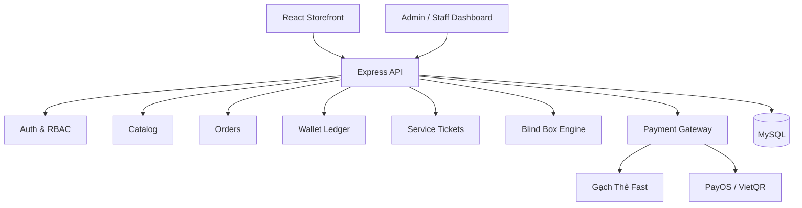

# KẾ HOẠCH THIẾT KẾ HỆ THỐNG SHOP ĐA DỊCH VỤ

**Dự án:** Auto Rejoin Pro / SandG Store  
**Repository:** `Gnas260605/auto-rejoin`  
**Mục tiêu:** Nâng cấp website bán key hiện tại thành nền tảng thương mại đa sản phẩm, có ví khách hàng, nạp thẻ Gạch Thẻ Fast, túi mù và quy trình xử lý dịch vụ.

---

## 1. Phạm vi sản phẩm

Hệ thống mới hỗ trợ bốn nhóm chính:

1. **Sản phẩm giao tự động**
   - Key Auto Rejoin.
   - Digital key/code nhập từ kho.
   - File hoặc đường dẫn tải xuống.

2. **Túi mù**
   - Khách mua lượt mở bằng số dư ví.
   - Kết quả được chọn ở backend theo cấu hình tỷ lệ.
   - Phần thưởng lấy từ kho thật và được giữ trong transaction.
   - Lưu lịch sử mở, tỷ lệ tại thời điểm mở và kết quả nhận được.

3. **Dịch vụ xử lý thủ công hoặc bán tự động**
   - Mở khóa tài khoản.
   - Dịch vụ xác thực.
   - Reset HWID và các dịch vụ bổ sung sau này.
   - Mỗi dịch vụ có form dữ liệu riêng, SLA, nhân viên phụ trách và lịch sử trạng thái.

4. **Nạp tiền và thanh toán**
   - Nạp thẻ cào qua Gạch Thẻ Fast.
   - Chuyển khoản VietQR/PayOS hiện có.
   - Dùng số dư ví để mua mọi sản phẩm và dịch vụ.

---

## 2. Nguyên tắc kiến trúc

- Tiếp tục dùng stack hiện tại: React, Node.js/Express và MySQL.
- Giữ nguyên hệ thống license hiện có, đặt nó sau lớp fulfillment chung.
- Tách rõ `catalog`, `order`, `payment`, `wallet`, `service ticket`, `blind box` và `fulfillment`.
- Mọi thay đổi số dư, tồn kho và phần thưởng phải chạy trong database transaction.
- Giá bán luôn được lấy lại từ database ở backend; không tin giá frontend gửi lên.
- Callback thanh toán phải idempotent: gọi lại nhiều lần vẫn chỉ cộng tiền một lần.
- Không lưu mật khẩu tài khoản Roblox hoặc dữ liệu xác thực dạng rõ nếu không thật sự cần thiết.
- Secret của đối tác chỉ tồn tại trong biến môi trường của backend.

---

## 3. Kiến trúc tổng thể



### Module backend đề xuất

```text
server/src/
├── modules/
│   ├── auth/
│   ├── users/
│   ├── catalog/
│   ├── orders/
│   ├── wallet/
│   ├── payments/
│   │   ├── providers/gachthefast.provider.js
│   │   └── providers/payos.provider.js
│   ├── blind-box/
│   ├── service-tickets/
│   ├── fulfillment/
│   └── audit/
├── middleware/
├── config/
└── app.js
```

Không bắt buộc di chuyển toàn bộ code cũ ngay. Phase đầu có thể thêm module mới rồi chuyển dần logic trong `commerce.service.js` và `payment.service.js`.

---

## 4. Vai trò và phân quyền

| Vai trò | Quyền chính |
|---|---|
| Guest | Xem sản phẩm, đăng ký, đăng nhập, tra cứu đơn bằng mã an toàn |
| Customer | Quản lý hồ sơ, ví, nạp tiền, mua hàng, mở túi, tạo/yêu cầu hỗ trợ |
| Staff | Nhận và xử lý ticket được phân công, ghi chú nội bộ, cập nhật tiến độ |
| Admin | Quản lý toàn bộ sản phẩm, giá, kho, tỷ lệ túi mù, giao dịch và nhân viên |
| Super Admin | Cấu hình hệ thống, payment provider, RBAC và audit; không hiện secret đầy đủ |

RBAC nên dùng permission cụ thể thay vì chỉ kiểm tra tên role:

```text
catalog.read, catalog.write
inventory.read, inventory.write
orders.read, orders.update, orders.refund
tickets.read, tickets.assign, tickets.process
payments.read, payments.reconcile
blindbox.configure
users.read, users.update, users.ban
staff.manage, settings.manage, audit.read
```

---

## 5. Thiết kế dữ liệu

### 5.1 Người dùng và ví

#### `users`

- `id`
- `email` unique
- `phone` nullable unique
- `password_hash`
- `display_name`
- `role`
- `status`: `ACTIVE`, `LOCKED`, `BANNED`
- `email_verified_at`
- `created_at`, `updated_at`

#### `wallets`

- `id`
- `user_id` unique
- `balance` DECIMAL(15,2)
- `locked_balance` DECIMAL(15,2)
- `version` dùng optimistic locking
- `updated_at`

#### `wallet_transactions`

- `id`
- `wallet_id`
- `type`: `TOPUP`, `PURCHASE`, `REFUND`, `ADJUSTMENT`, `REWARD`
- `direction`: `CREDIT`, `DEBIT`
- `amount`
- `balance_before`, `balance_after`
- `reference_type`, `reference_id`
- `idempotency_key` unique
- `description`
- `created_by`, `created_at`

`wallet_transactions` là sổ cái bất biến. Không được sửa hoặc xóa giao dịch đã ghi; nếu cần điều chỉnh phải tạo giao dịch bù.

### 5.2 Danh mục sản phẩm

Tiếp tục sử dụng `products` và `product_variants`, nhưng bổ sung:

#### `products`

- `type`: `LICENSE`, `DIGITAL_KEY`, `DOWNLOAD`, `SERVICE`, `BLIND_BOX`
- `category_id`
- `fulfillment_mode`: `AUTO`, `MANUAL`, `HYBRID`
- `service_form_schema_json`
- `status`: `DRAFT`, `ACTIVE`, `HIDDEN`, `ARCHIVED`
- `sort_order`, SEO fields, ảnh và nội dung bảo hành

#### `product_categories`

- `id`, `slug`, `name`, `icon`, `image_url`
- `parent_id` nullable
- `status`, `sort_order`

#### `inventory_items`

- Dùng cho key và phần thưởng số.
- Secret phải được mã hóa AES-GCM.
- Trạng thái: `AVAILABLE`, `RESERVED`, `SOLD`, `DISABLED`.
- Có `reserved_until` để tự giải phóng tồn kho khi đơn hết hạn.

### 5.3 Đơn hàng

#### `orders`

- `id`, `order_code` unique
- `user_id`
- `subtotal`, `discount_amount`, `total_amount`
- `payment_method`: `WALLET`, `CARD`, `PAYOS`, `VIETQR`
- `payment_status`: `UNPAID`, `PENDING`, `PAID`, `FAILED`, `REFUNDED`
- `fulfillment_status`: `PENDING`, `PROCESSING`, `COMPLETED`, `PARTIAL`, `FAILED`
- `status`: `PENDING`, `CONFIRMED`, `PROCESSING`, `COMPLETED`, `CANCELLED`, `EXPIRED`
- `idempotency_key`
- `created_at`, `paid_at`, `completed_at`, `expired_at`

#### `order_items`

- Snapshot tên sản phẩm, biến thể, giá và cấu hình tại thời điểm mua.
- Không phụ thuộc vào giá sản phẩm sau khi đơn đã được tạo.
- Có `input_data_encrypted` cho dữ liệu dịch vụ nhạy cảm.

### 5.4 Ticket dịch vụ

#### `service_tickets`

- `id`, `ticket_code` unique
- `order_item_id`, `user_id`
- `service_type`
- `status`: `NEW`, `WAITING_STAFF`, `IN_PROGRESS`, `WAITING_CUSTOMER`, `COMPLETED`, `REJECTED`, `CANCELLED`
- `priority`: `LOW`, `NORMAL`, `HIGH`, `URGENT`
- `assigned_staff_id`
- `sla_due_at`
- `customer_data_encrypted`
- `result_data_encrypted`
- `created_at`, `started_at`, `completed_at`

#### `service_ticket_messages`

- Tin nhắn khách hàng/nhân viên.
- Phân biệt `PUBLIC` và `INTERNAL_NOTE`.
- Attachment cần giới hạn loại file, kích thước và quét nội dung nguy hiểm.

#### `service_ticket_events`

- Audit mọi lần gán nhân viên, đổi trạng thái, yêu cầu bổ sung và hoàn thành.

### 5.5 Túi mù

#### `blind_boxes`

- Liên kết một sản phẩm `BLIND_BOX`.
- Giá mở, trạng thái, thời gian hoạt động.
- `published_version` để khóa cấu hình tỷ lệ đang bán.

#### `blind_box_rewards`

- `blind_box_id`
- `reward_type`: `INVENTORY_ITEM`, `WALLET_CREDIT`, `LICENSE`, `COUPON`
- `reward_reference_id`
- `weight`
- `stock_limit`, `remaining_stock`
- `is_active`

#### `blind_box_openings`

- `id`, `opening_code` unique
- `user_id`, `blind_box_id`, `order_id`
- `config_snapshot_json`
- `selected_reward_id`
- `random_proof_hash`
- `status`: `PROCESSING`, `SUCCESS`, `FAILED`, `REFUNDED`
- `opened_at`

Quá trình mở túi phải khóa dòng phần thưởng, kiểm tra tồn kho, trừ tiền và cấp quà trong cùng transaction. Nếu cấp quà lỗi thì rollback hoặc tự động hoàn ví.

### 5.6 Nạp thẻ Gạch Thẻ Fast

Nâng cấp `card_transactions` thành:

- `id`, `request_id` unique
- `user_id`
- `provider`: `GACHTHEFAST`
- `provider_trans_id`
- `telco`, `serial_masked`
- `code_encrypted`
- `declared_amount`
- `card_value`
- `received_amount`
- `status_code`
- `status`: `CREATED`, `SUBMITTED`, `PENDING`, `SUCCESS`, `WRONG_AMOUNT`, `FAILED`, `MAINTENANCE`, `REJECTED`
- `provider_message`
- `credited_at`
- `callback_payload_json` đã loại dữ liệu nhạy cảm
- `retry_count`, `last_checked_at`
- `created_at`, `updated_at`

Thêm unique constraint để chống cộng tiền hai lần:

```text
UNIQUE(provider, request_id)
UNIQUE(wallet_transactions.idempotency_key)
```

---

## 6. Tích hợp Gạch Thẻ Fast

### 6.1 Biến môi trường

```env
GACHTHEFAST_BASE_URL=https://domain-thuc-te
GACHTHEFAST_PARTNER_ID=
GACHTHEFAST_PARTNER_KEY=
GACHTHEFAST_TIMEOUT_MS=10000
GACHTHEFAST_CALLBACK_TOKEN=
```

### 6.2 Gửi thẻ

Endpoint đối tác:

```text
POST {GACHTHEFAST_BASE_URL}/chargingws/v2
```

Chữ ký:

```text
MD5(partner_key + code + serial)
```

Payload:

```text
telco, code, serial, amount, request_id,
partner_id, sign, command=charging
```

Gửi dạng form tương thích với ví dụ cURL của nhà cung cấp. Không tự đặt multipart boundary.

### 6.3 Ánh xạ kết quả

| Provider status | Nội bộ | Hành động |
|---:|---|---|
| 1 | SUCCESS | Cộng `received_amount` vào ví đúng một lần |
| 2 | WRONG_AMOUNT | Áp dụng chính sách sai mệnh giá rồi cộng đúng một lần |
| 3 | FAILED | Không cộng tiền |
| 4 | MAINTENANCE | Giữ giao dịch để retry/check |
| 99 | PENDING | Chờ callback hoặc kiểm tra chủ động |
| 100 | REJECTED | Không cộng, lưu thông báo |

### 6.4 Callback và kiểm tra chủ động

- Tạo endpoint `POST /api/v1/payments/cards/gachthefast/callback`.
- Bảo vệ callback bằng token/IP allowlist/chữ ký nếu nhà cung cấp hỗ trợ.
- Đối chiếu `request_id`, nhà mạng, serial đã che và giá trị khai báo.
- Callback chỉ cập nhật giao dịch nếu chuyển trạng thái hợp lệ.
- Credit ví và đánh dấu `credited_at` trong cùng transaction.
- Worker kiểm tra lại giao dịch `PENDING` bằng `command=check` theo lịch 1, 3, 5, 10 phút.
- Dừng retry khi đạt trạng thái cuối hoặc vượt thời gian cấu hình.

> Chưa được triển khai callback production cho đến khi có tài liệu chính xác về payload và phương thức xác minh callback của Gạch Thẻ Fast.

---

## 7. API đề xuất

### Auth và khách hàng

```text
POST /api/v1/auth/register
POST /api/v1/auth/login
POST /api/v1/auth/logout
POST /api/v1/auth/refresh
GET  /api/v1/me
```

### Catalog

```text
GET /api/v1/store/categories
GET /api/v1/store/products
GET /api/v1/store/products/:slug
```

### Ví và nạp tiền

```text
GET  /api/v1/wallet
GET  /api/v1/wallet/transactions
POST /api/v1/payments/cards
GET  /api/v1/payments/cards/:requestId
POST /api/v1/payments/cards/gachthefast/callback
```

### Đơn hàng

```text
POST /api/v1/orders
GET  /api/v1/orders
GET  /api/v1/orders/:orderCode
POST /api/v1/orders/:orderCode/pay-wallet
POST /api/v1/orders/:orderCode/cancel
```

### Túi mù

```text
GET  /api/v1/blind-boxes
GET  /api/v1/blind-boxes/:slug
POST /api/v1/blind-boxes/:id/open
GET  /api/v1/blind-box-openings
GET  /api/v1/blind-box-openings/:openingCode
```

### Ticket dịch vụ

```text
GET  /api/v1/service-tickets
GET  /api/v1/service-tickets/:ticketCode
POST /api/v1/service-tickets/:ticketCode/messages
POST /api/v1/service-tickets/:ticketCode/cancel
```

### Staff

```text
GET  /api/v1/staff/tickets
POST /api/v1/staff/tickets/:id/claim
PATCH /api/v1/staff/tickets/:id/status
POST /api/v1/staff/tickets/:id/messages
```

### Admin

```text
/api/v1/admin/categories
/api/v1/admin/products
/api/v1/admin/inventory
/api/v1/admin/orders
/api/v1/admin/service-tickets
/api/v1/admin/blind-boxes
/api/v1/admin/card-transactions
/api/v1/admin/users
/api/v1/admin/staff
/api/v1/admin/audit
```

---

## 8. Giao diện cần thiết kế

### 8.1 Khách hàng

1. Trang chủ và danh mục sản phẩm.
2. Chi tiết sản phẩm/key.
3. Chi tiết dịch vụ với form động.
4. Danh sách và giao diện mở túi mù.
5. Giỏ hàng và checkout.
6. Đăng ký, đăng nhập, quên mật khẩu.
7. Dashboard khách hàng.
8. Ví tiền và form nạp thẻ.
9. Lịch sử giao dịch.
10. Lịch sử đơn hàng và nội dung đã giao.
11. Danh sách ticket dịch vụ.
12. Chi tiết ticket và khung trao đổi.

### 8.2 Nhân viên

1. Dashboard số đơn mới/đang xử lý/quá SLA.
2. Hàng đợi ticket.
3. Ticket của tôi.
4. Chi tiết ticket với dữ liệu được phép xem.
5. Ghi chú nội bộ và trao đổi với khách.
6. Lịch sử thao tác cá nhân.

### 8.3 Admin

1. Tổng quan doanh thu, nạp tiền, đơn hàng và SLA.
2. Quản lý danh mục/sản phẩm/biến thể.
3. Quản lý kho key và tồn phần thưởng.
4. Trình cấu hình túi mù và tỷ lệ.
5. Quản lý đơn và refund.
6. Quản lý ticket và phân công nhân viên.
7. Quản lý giao dịch Gạch Thẻ Fast và đối soát.
8. Quản lý user, staff, role và permission.
9. Cấu hình payment provider dạng masked.
10. Audit log.

---

## 9. Quy trình nghiệp vụ

### 9.1 Mua key tự động

1. Khách đăng nhập và chọn sản phẩm.
2. Backend kiểm tra giá, tồn kho và số dư.
3. Khóa ví và tồn kho trong transaction.
4. Tạo đơn `PAID`.
5. Fulfillment cấp key/license.
6. Hiển thị key trong trang đơn hàng; gửi email chỉ chứa thông báo, không gửi secret nếu không cần.

### 9.2 Mua dịch vụ

1. Khách điền form theo schema của sản phẩm.
2. Backend validate và mã hóa dữ liệu nhạy cảm.
3. Thanh toán bằng ví.
4. Tạo order item và service ticket.
5. Staff nhận ticket, xử lý và cập nhật tiến độ.
6. Khách bổ sung thông tin qua thread khi cần.
7. Staff trả kết quả; hệ thống ghi audit và hoàn thành đơn.

### 9.3 Mở túi mù

1. Khách nhấn mở và gửi idempotency key.
2. Backend khóa ví và cấu hình túi hiện hành.
3. Kiểm tra phần thưởng còn tồn.
4. Chọn kết quả bằng CSPRNG của Node.js, không dùng `Math.random()`.
5. Trừ tiền, trừ tồn, ghi snapshot và cấp thưởng trong transaction.
6. Trả kết quả để frontend chạy animation.

Animation không được tự quyết định kết quả; frontend chỉ trình bày kết quả backend đã cấp.

---

## 10. Bảo mật bắt buộc

- Hash mật khẩu bằng Argon2id hoặc bcrypt với cost phù hợp.
- Access token ngắn hạn và refresh token xoay vòng; ưu tiên cookie `HttpOnly`, `Secure`, `SameSite`.
- CSRF protection nếu dùng cookie authentication.
- Rate limit riêng cho login, gửi thẻ, kiểm tra thẻ, checkout và mở túi.
- AES-256-GCM cho mã thẻ, key kho và dữ liệu dịch vụ nhạy cảm.
- Không log `partner_key`, mã thẻ, mật khẩu, cookie Roblox hoặc token.
- Mask serial, email, số điện thoại và secret trong admin UI.
- Validation bằng Zod cho toàn bộ request.
- Idempotency key cho top-up, callback, thanh toán ví và mở túi.
- Audit log bất biến cho hành động admin/staff.
- File upload dùng allowlist MIME/extension, random filename và giới hạn dung lượng.
- CORS allowlist theo domain production.
- Helmet, body-size limit, timeout outbound và circuit breaker cơ bản.
- Backup database và diễn tập restore định kỳ.

Đối với dịch vụ tài khoản: ưu tiên quy trình OAuth, mã dùng một lần hoặc phiên hỗ trợ. Nếu buộc phải nhận secret, phải mã hóa, giới hạn người xem và tự động xóa sau khi ticket hoàn tất theo thời gian cấu hình.

---

## 11. Quan sát, đối soát và xử lý lỗi

- Structured log kèm `request_id`, `order_code`, `ticket_code`; không kèm secret.
- Metrics: tỷ lệ nạp thẻ thành công, callback trễ, đơn fulfillment lỗi, ticket quá SLA, lỗi mở túi.
- Job đối soát giao dịch thẻ `PENDING` và giao dịch đã thành công nhưng chưa credit.
- Job giải phóng inventory reservation hết hạn.
- Dead-letter/retry table cho fulfillment lỗi.
- Admin có nút retry an toàn, luôn yêu cầu idempotency.
- Cảnh báo khi tồn kho thấp hoặc tỷ lệ lỗi cổng thanh toán tăng.

---

## 12. Kế hoạch triển khai theo phase

### Phase 0 — Chốt nghiệp vụ và backup

- Xác định rõ dịch vụ xác thực là gì và dữ liệu cần thu thập.
- Chốt chính sách sai mệnh giá, hoàn tiền, hủy dịch vụ và SLA.
- Lấy domain, callback schema và phương thức xác minh callback của Gạch Thẻ Fast.
- Backup database; lập danh sách API/UI hiện tại phải giữ tương thích.

**Kết quả:** tài liệu nghiệp vụ được duyệt, migration có rollback plan.

### Phase 1 — User, Auth, RBAC và Wallet

- Tạo user/customer authentication.
- Tạo wallet và immutable ledger.
- Thêm middleware permission.
- Viết test race condition và double spending.

**Tiêu chí đạt:** hai request mua đồng thời không thể làm số dư âm; staff không truy cập API admin.

### Phase 2 — Catalog đa loại và Order Engine

- Mở rộng product type/category/variant.
- Chuẩn hóa order/payment/fulfillment status.
- Checkout bằng ví.
- Chuyển license và digital key hiện có vào fulfillment engine.

**Tiêu chí đạt:** bán được key cũ qua order engine mới mà không phá API license hiện hành.

### Phase 3 — Gạch Thẻ Fast

- Viết provider adapter.
- Migration card transaction an toàn.
- Endpoint gửi thẻ, status, callback.
- Worker `command=check` và đối soát.
- Mã hóa code; ngừng lưu PIN rõ.

**Tiêu chí đạt:** status `1/2` chỉ credit một lần dù callback gửi lặp; `3/100` không credit.

### Phase 4 — Service Ticket

- Form schema động cho từng dịch vụ.
- Ticket, message, attachment, SLA và assignment.
- Dashboard staff tách biệt admin.
- Thông báo cho khách khi đổi trạng thái.

**Tiêu chí đạt:** toàn bộ vòng đời đơn mở khóa/xác thực có audit và không lộ dữ liệu cho staff không phụ trách.

### Phase 5 — Blind Box

- Cấu hình reward pool, weight, stock và version.
- Engine CSPRNG chạy transaction.
- Lịch sử mở và fulfillment phần thưởng.
- UI animation chỉ dựa trên kết quả backend.

**Tiêu chí đạt:** không âm kho, không trừ tiền khi cấp quà thất bại, không thể mở lại cùng idempotency key.

### Phase 6 — Admin và UX khách hàng

- Hoàn thiện dashboard user, wallet, order, ticket.
- Admin catalog, inventory, blind box, card reconciliation.
- Phân trang/filter/search server-side.
- Responsive và accessibility cơ bản.

### Phase 7 — Hardening và Production

- Unit, integration, concurrency và end-to-end tests.
- Security review, dependency audit và secret scan.
- Staging với tài khoản đối tác test.
- Backup/restore drill.
- Rollout theo feature flag và theo dõi metrics.

---

## 13. Chiến lược migration từ repo hiện tại

1. Không xóa `licenses`, API activate/validate/deactivate hoặc dữ liệu key hiện tại.
2. Giữ storefront cũ hoạt động trong khi thêm auth và wallet dưới feature flag.
3. Dùng bảng migration mới thay vì sửa dữ liệu production bằng tay.
4. Viết adapter để `LICENSE` vẫn gọi `license.service.js` hiện tại.
5. Di chuyển `submitCardTopup()` sang `GachTheFastProvider`; endpoint cũ có thể gọi service mới trong giai đoạn tương thích.
6. Đổi `card_transactions.pin` rõ sang `code_encrypted`; migration phải mã hóa dữ liệu cần giữ hoặc xóa dữ liệu cũ theo chính sách.
7. Chuyển logic `SERVICE` chung trong `fulfillOrder()` sang service ticket; không tự đánh dấu mọi dịch vụ là thành công.
8. Sau khi frontend mới ổn định, ngừng route thanh toán key cũ và xóa code qua một release riêng.

---

## 14. Test bắt buộc

### Unit

- Tạo chữ ký Gạch Thẻ Fast.
- Ánh xạ status provider.
- Tính wallet ledger.
- Chọn reward theo weight.
- State transition của order và ticket.

### Integration

- Callback lặp nhiều lần.
- Callback đến trước response gửi thẻ.
- Hai request mua hàng cùng lúc.
- Tồn kho hết trong lúc checkout.
- Gạch Thẻ Fast timeout hoặc trả JSON sai.
- Service fulfillment thất bại và refund.

### E2E

- Đăng ký → nạp thẻ → callback → ví tăng → mua key.
- Nạp sai mệnh giá.
- Mua dịch vụ → staff nhận → yêu cầu bổ sung → hoàn thành.
- Mở túi → nhận key/wallet reward → xem lịch sử.
- Admin đổi tỷ lệ túi nhưng lượt cũ vẫn giữ snapshot đúng.

---

## 15. Thứ tự ưu tiên thực tế

Nếu muốn ra phiên bản dùng được sớm, triển khai theo thứ tự:

1. Auth + wallet ledger.
2. Gạch Thẻ Fast và đối soát.
3. Checkout đa sản phẩm + fulfillment key cũ.
4. Service ticket + dashboard staff.
5. Túi mù.
6. Admin reporting, marketing và tối ưu UI.

Không nên làm túi mù trước wallet/ledger vì sẽ khó đảm bảo hoàn tiền, chống mở trùng và kiểm toán kết quả.

---

## 16. Definition of Done toàn hệ thống

- Khách có thể đăng ký, nạp tiền và thấy lịch sử ví chính xác.
- Website bán được nhiều loại sản phẩm trong cùng catalog.
- Key giao tự động; dịch vụ tạo ticket cho staff.
- Túi mù không âm tồn, không trừ tiền oan và có lịch sử kiểm tra.
- Gạch Thẻ Fast hoạt động qua callback lẫn kiểm tra chủ động.
- Callback lặp không làm tăng ví lần hai.
- Admin/staff được phân quyền đúng và mọi thao tác nhạy cảm có audit.
- Không có secret trong frontend, log hoặc Git.
- Migration, backup, rollback và test production checklist đầy đủ.

---

## 17. Thông tin còn phải chốt trước khi code Phase 3–5

1. Domain production của Gạch Thẻ Fast.
2. Payload callback và cơ chế xác minh callback.
3. Công thức `received_amount` và chính sách thẻ sai mệnh giá.
4. “Dịch vụ xác thực” áp dụng cho nền tảng/tài khoản nào.
5. Trường dữ liệu cần thu cho từng loại dịch vụ.
6. Thời gian SLA, chính sách hủy và hoàn tiền.
7. Danh sách quà, số lượng và tỷ lệ túi mù.
8. Khách bắt buộc đăng nhập hay có hỗ trợ guest checkout.

